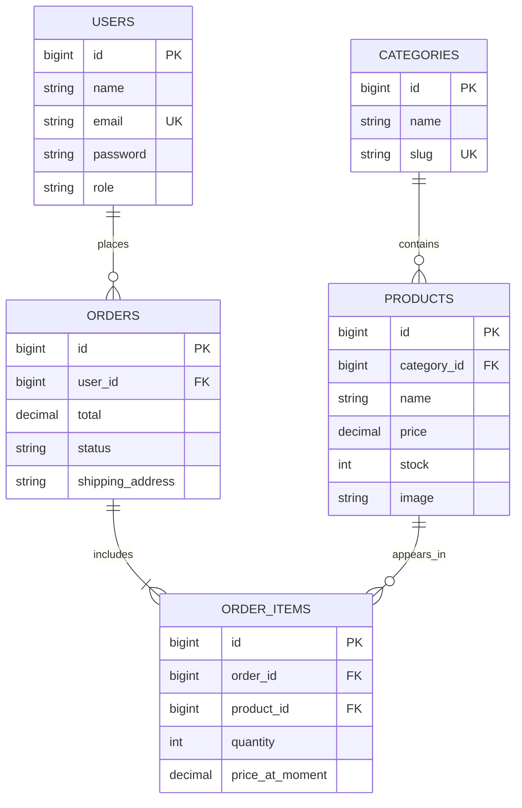
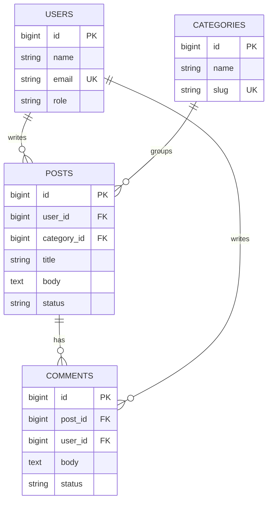

# Шаблон ER-діаграми для курсової

> **Призначення:** дати студенту копійований старт для ER-діаграми в Mermaid або DBDiagram.
> Не копіюй шаблон буквально. Візьми свій тип системи і заміни назви сутностей під власну тему.

---

## 1. Правило вибору шаблону

- **Shop** → товари, категорії, замовлення, позиції замовлення
- **Booking** → послуги, майстри/ресурси, бронювання
- **Catalog** → записи каталогу, категорії, обране/резервування
- **Community** → пости, коментарі, категорії/теги
- **Internal** → користувачі, довідники, бізнес-сутності, задачі/статуси

Якщо тема змішана, намалюй ядро системи окремо, а бонусний блок додай другим колом.

---

## 2. Mermaid шаблон: Shop



---

## 3. Mermaid шаблон: Booking

```mermaid
erDiagram
    USERS ||--o{ BOOKINGS : creates
    SERVICES ||--o{ BOOKINGS : selected_for
    MASTERS ||--o{ BOOKINGS : serves

    USERS {
        bigint id PK
        string name
        string email UK
        string role
    }

    SERVICES {
        bigint id PK
        string name
        int duration_min
        decimal price
    }

    MASTERS {
        bigint id PK
        string name
        string specialization
    }

    BOOKINGS {
        bigint id PK
        bigint user_id FK
        bigint service_id FK
        bigint master_id FK
        date booking_date
        time booking_time
        string status
    }
```



---

## 4. Mermaid шаблон: Community



---

## 5. DBDiagram шаблон: Shop

```sql
Table users {
  id bigint [pk, increment]
  name varchar
  email varchar [unique]
  password varchar
  role varchar
  created_at timestamp
}

Table categories {
  id bigint [pk, increment]
  name varchar
  slug varchar [unique]
}

Table products {
  id bigint [pk, increment]
  category_id bigint [ref: > categories.id]
  name varchar
  price decimal
  stock int
  image varchar
}

Table orders {
  id bigint [pk, increment]
  user_id bigint [ref: > users.id]
  total decimal
  status varchar
  shipping_address varchar
}

Table order_items {
  id bigint [pk, increment]
  order_id bigint [ref: > orders.id]
  product_id bigint [ref: > products.id]
  quantity int
  price_at_moment decimal
}
```

---

## 6. Що обов'язково має бути на ER-діаграмі

- [ ] Усі ключові сутності курсової, а не лише 2-3 таблиці з демо
- [ ] Позначені PK і FK
- [ ] Видно cardinality: `1:N`, `M:N` через pivot-таблицю
- [ ] Назви таблиць і полів збігаються з реальною БД/міграціями
- [ ] Є хоча б 3 бізнес-зв'язки, а не тільки `users`
- [ ] Якщо є ролі, вони або в `users.role`, або в окремій `roles`

---

## 7. Типові помилки ER-діаграм

- `products` без `category_id`, хоча в UI є категорії
- `orders` без `user_id`, хоча замовлення робить user
- many-to-many намальовано напряму без pivot-таблиці
- назви в діаграмі одні, а в міграціях інші
- у діаграмі є поля, яких немає в реальній схемі

---

## 8. Пов'язані документи

- [schemas.md](schemas.md) — еталонні схеми для різних типів і рівнів
- [er-diagrams.md](er-diagrams.md) — готові приклади Mermaid ER
- [assignment.md](assignment.md) — ER-діаграма входить у ПЗ
- [defense-checklist.md](defense-checklist.md) — комісія часто питає про зв'язки між таблицями