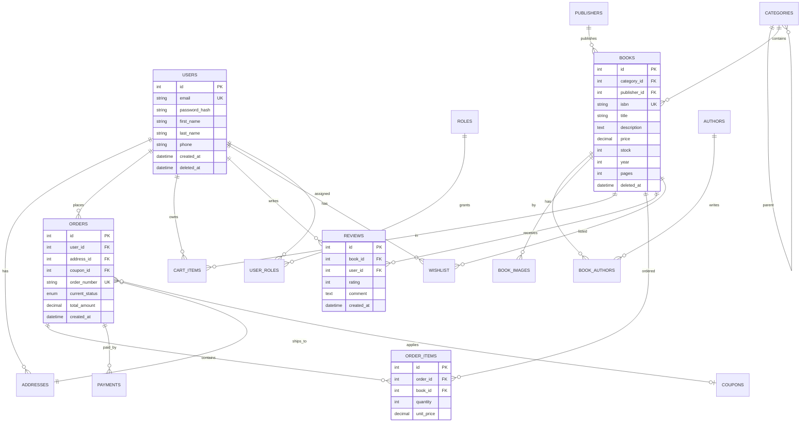
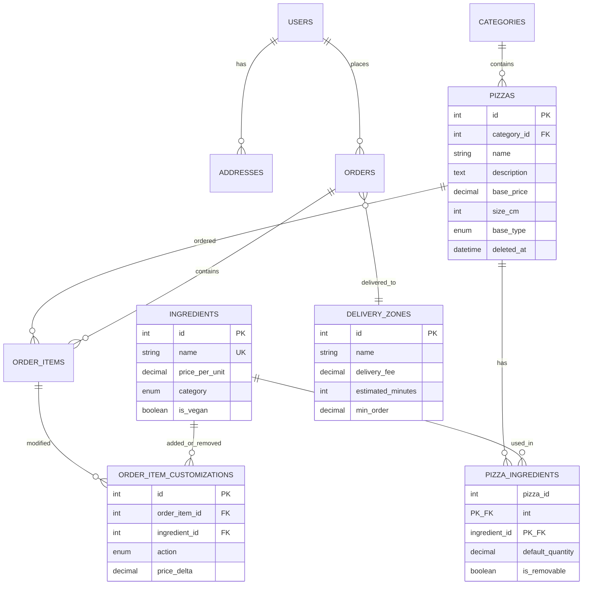
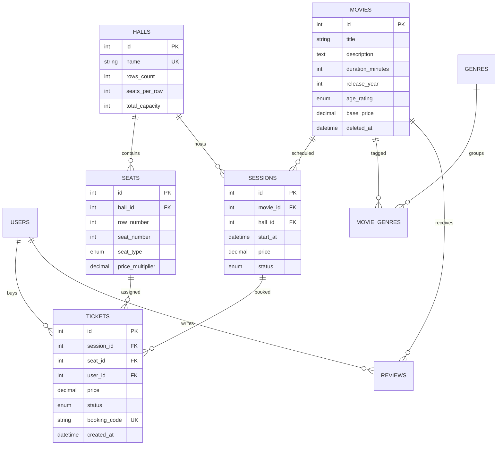
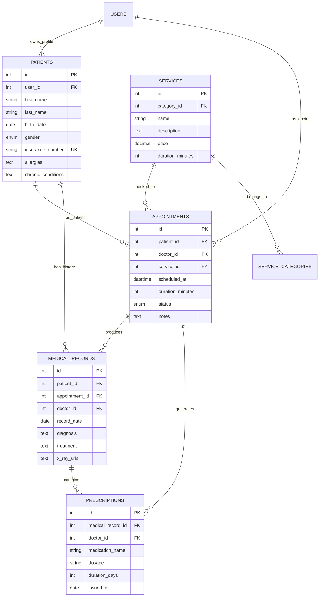
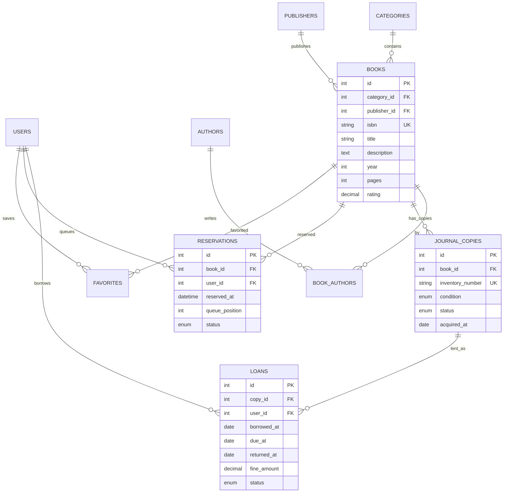
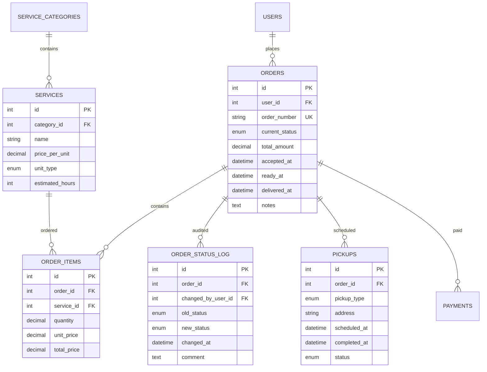
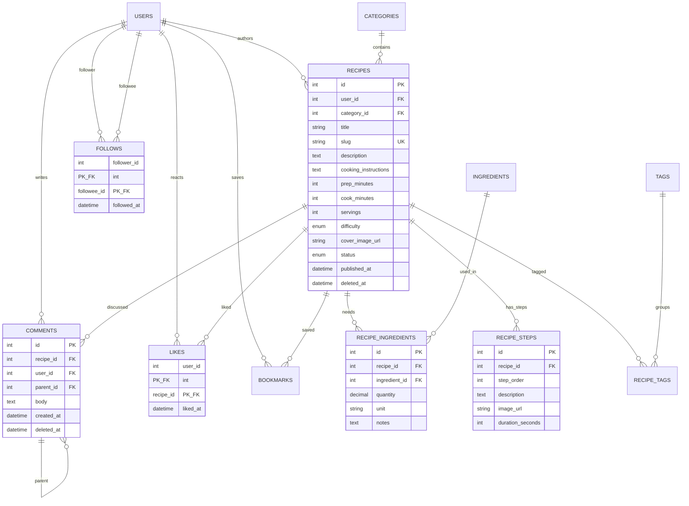
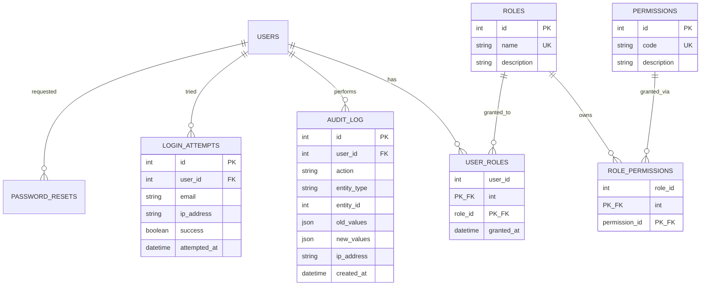

# ER-діаграми референсних варіантів

> **Призначення:** візуалізація схем БД у Mermaid `erDiagram` для 7 еталонних варіантів курсової.
> Базується на DDL зі [schemas.md](schemas.md). Для швидкої орієнтації студента перед читанням повного DDL.
>
> **Як використовувати:** відкрийте файл у редакторі з підтримкою Mermaid (VS Code + Mermaid Preview, GitHub, Obsidian) — діаграми рендеряться автоматично.
> Для курсової: скопіюйте Mermaid-код у свій документ, додайте заголовок «Рис. X.Y — ER-діаграма БД».

## Зміст

1. [v1 Книгарня (E-commerce)](#1-v1-книгарня-e-commerce)
2. [v4 Піцерія (E-commerce + customization)](#2-v4-піцерія-e-commerce--customization)
3. [v3 Кінотеатр (Booking + race condition)](#3-v3-кінотеатр-booking--race-condition)
4. [v14 Стоматологія (Booking + medical)](#4-v14-стоматологія-booking--medical)
5. [v7 Бібліотека (Catalog + lifecycle)](#5-v7-бібліотека-catalog--lifecycle)
6. [v20 Пральня (Service-order + status log)](#6-v20-пральня-service-order--status-log)
7. [v30 Кулінарний блог (UGC + social)](#7-v30-кулінарний-блог-ugc--social)
8. [Крос-модулі (RBAC + audit)](#8-крос-модулі-rbac--audit)

---

## 1. v1 Книгарня (E-commerce)

**Ключові сутності:** users, books, orders, cart_items + категоризація, автори, відгуки, купони.
**Ключові зв'язки:** N↔N (books ↔ authors), 1↔N (orders → order_items), soft FK (reviews → users).

**Нотатки для захисту:**

- `deleted_at` на `users` + `books` — soft delete, збереження історичної цілісності замовлень.
- `UNIQUE(email)` на users + `UNIQUE(isbn)` на books — запобігає дублюванню на рівні БД.
- `book_authors` (junction) — N↔N з composite PK `(book_id, author_id)`.
- `current_status` як ENUM для швидкого запиту + окрема таблиця `order_status_log` для історії.

---

## 2. v4 Піцерія (E-commerce + customization)

**Розширення над v1:** кастомізація позицій (інгредієнти), зони доставки, тайм-слоти.
**Ключові зв'язки:** N↔N (pizzas ↔ ingredients), кастомізація на рівні order_items.

**Нотатки:**

- `pizza_ingredients` — default склад (що йде в піцу стандартно).
- `order_item_customizations` — що клієнт додав/прибрав для конкретного замовлення (`action` = ADD/REMOVE).
- `delivery_zones.min_order` — бізнес-правило мінімального замовлення.
- Enum `base_type` (traditional/thin/thick) — для фільтрації у меню.

---

## 3. v3 Кінотеатр (Booking + race condition)

**Ключова особливість:** запобігання подвійного бронювання через `UNIQUE(session_id, seat_id)`.
**Ключові зв'язки:** halls → seats, movies → sessions, tickets = композитний бронюючий ключ.

**Ключові constraints для захисту:**

- `UNIQUE(session_id, seat_id)` у tickets → БД не дозволить другого квитка на те саме місце в тому ж сеансі навіть при race condition.
- `seats.price_multiplier` (1.0 для звичайних, 1.5 для VIP) — множник до `sessions.price`.
- `tickets.status` ENUM: reserved → paid → used, або reserved → cancelled.
- `sessions.status`: scheduled/cancelled/completed — для фільтрації активних сеансів.

---

## 4. v14 Стоматологія (Booking + medical)

**Розширення над v3:** пацієнти ≠ users (пацієнта може вести опікун), медичні записи, рецепти.
**Ключові зв'язки:** doctors (users+role), patients, appointments, medical_records, prescriptions.

**Нотатки:**

- `patients` окремо від `users` — бо дитина може бути пацієнтом, а батьки мають аккаунт.
- `UNIQUE(doctor_id, scheduled_at)` для appointments — один лікар = одна зустріч в конкретний слот.
- `medical_records.x_ray_urls` як JSON array — гнучке зберігання медіа.
- `prescriptions.duration_days` + `issued_at` — для автоматичного розрахунку дати закінчення рецепту.

---

## 5. v7 Бібліотека (Catalog + lifecycle)

**Особливість:** кожен примірник (copy) окремо, життєвий цикл позички (loan).
**Ключові зв'язки:** books → copies → loans, reservations (черга очікування).

**Ключові моменти:**

- `journal_copies` — кожен фізичний примірник окремо (inventory_number = штрих-код).
- `copies.status`: available/loaned/damaged/lost — для швидкого фільтру «що можна взяти».
- `loans.due_at` + `returned_at` — для автоматичного розрахунку штрафу (`fine_amount`).
- `reservations.queue_position` — якщо книга зайнята, черга очікування (auto-recalc on return).

---

## 6. v20 Пральня (Service-order + status log)

**Особливість:** тригер автоматично записує історію статусів у `order_status_log`.
**Ключові зв'язки:** orders → items → services, pickups (адреса забрати/доставити).

**Ключові моменти:**

- `order_status_log` наповнюється через `AFTER UPDATE` тригер на `orders` — студент показує на захисті.
- `pickups.pickup_type` = collection (забрати) / delivery (доставити) — один order може мати дві pickups.
- `services.unit_type` ENUM: kg/item/m2 — різні одиниці для різних послуг (прання кг, прасування штук).
- `orders.accepted_at/ready_at/delivered_at` — ключові timestamps для SLA-звітності.

---

## 7. v30 Кулінарний блог (UGC + social)

**Особливість:** user-generated content, social features (likes, bookmarks, follows, nested comments).
**Ключові зв'язки:** self-reference (comments.parent_id, users ↔ users через follows), N↔N (recipes ↔ tags).

**Ключові моменти:**

- `comments.parent_id` (self-FK) — nested коментарі (Reddit-style).
- `follows` — composite PK `(follower_id, followee_id)` + CHECK `follower_id != followee_id`.
- `likes`/`bookmarks` — composite PK для запобігання дублів.
- `recipes.slug` UNIQUE — для SEO-friendly URLs (`/recipes/borsch-po-kiivsky`).
- `recipes.status` ENUM: draft/published/archived — lifecycle поста.

---

## 8. Крос-модулі (RBAC + audit)

**Застосування:** однакова структура для всіх варіантів. Не малюється окремо для кожної ER, але **обов'язково згадується** в курсовій.

**Навіщо показати на захисті:**

- **RBAC** (user_roles + role_permissions) — масштабовано, додавання нової ролі не вимагає змін коду.
- **audit_log** — хто/що/коли змінив, обов'язковий для бізнес-систем (GDPR-compliance).
- **login_attempts** — для запобігання brute-force (rate limiting на рівні додатку).
- **password_resets** з `expires_at` + `used_at` — одноразові токени з TTL.

---

## Як рендерити Mermaid

- **VS Code:** встановити розширення `Markdown Preview Mermaid Support` → Ctrl+Shift+V.
- **GitHub/GitLab:** ренедриться автоматично в `.md` файлах.
- **Obsidian:** нативна підтримка.
- **Експорт у PNG:** [mermaid.live](https://mermaid.live) → paste → Export.
- **У курсову (Word/docx):** експортувати PNG → вставити як «Рис. X.Y — ER-діаграма БД».

## Посилання

- Повний DDL: [schemas.md](schemas.md)
- Чекліст перед здачею: [checklist-lr4.md](checklist-lr4.md)
- Типові помилки: [typical-mistakes.md](typical-mistakes.md)
