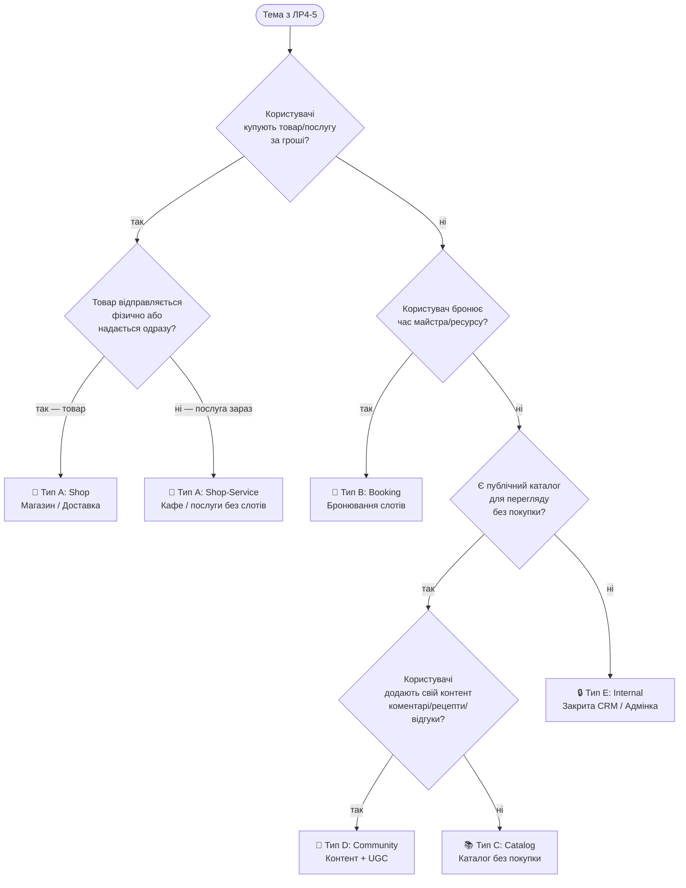
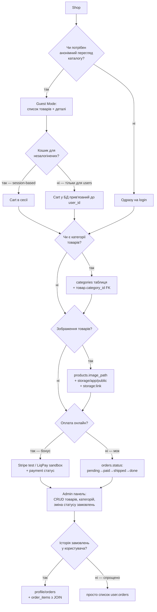
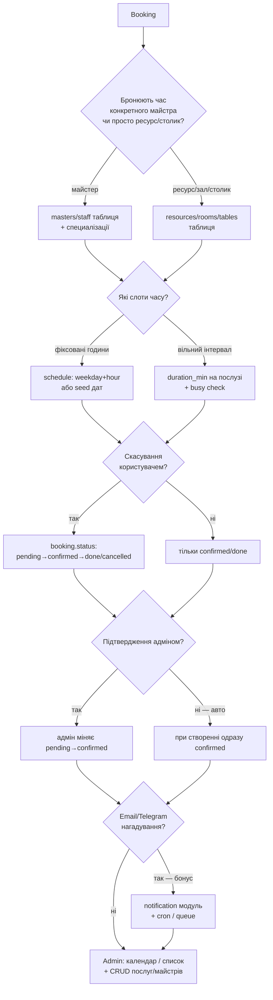
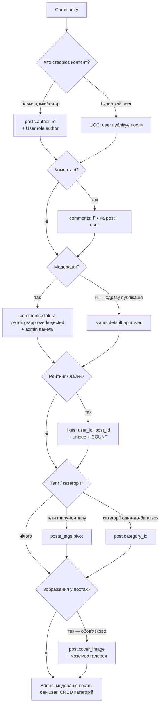
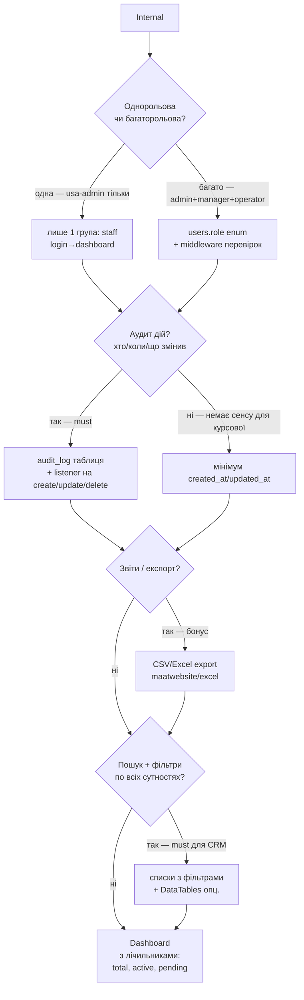
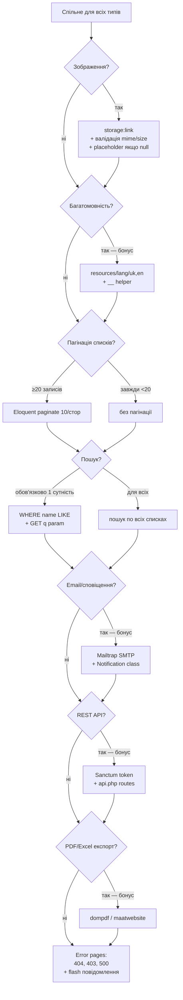
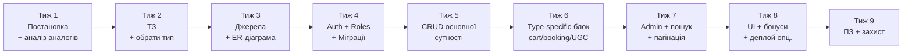

# Функціональний флоу курсової

**Навіщо документ.** Визначити **який функціонал** має бути у вашій курсовій — не «як писати код», а «що саме реалізовувати». Проходьте діаграми зверху вниз, відповідаючи **так/ні**. На кожному виході — список обов'язкових блоків.

> **Кодова база / структура / технології** → [system-design.md](system-design.md)
> **ПЗ (пояснювальна записка)** → [assignment.md](assignment.md) + [Метод_реком_бекенд122.pdf](Метод_реком_бекенд122.pdf)

---

## Крок 0. Що у вас вже є з ЛР4-ЛР5

Курсова **не починається з нуля**. З [ЛР4](../lr4/assignment.md) та [ЛР5](../lr5/assignment.md) у вас **уже реалізовано**:

| Модуль | Звідки | Що готове |
|--------|--------|-----------|
| MVC-каркас | ЛР4 | `Application`, `Router`, `Request`, `Controller`, `View` |
| Форма + валідація | ЛР4 | 1 тип форми (T1-T6 за варіантом), 7 полів мін. |
| Сесія | ЛР4 | Вибір кольору фону |
| Cookie | ЛР4 | «Вітаємо, ІМ'Я» |
| Роутинг | ЛР4 | `?route=` або `.htaccess` |
| Гостьова книга (файл) | ЛР5 | `data/comments.txt` (або CSV/JSONL за групою) |
| Upload зображень | ЛР5 | `data/uploads/` + галерея |
| Каталоги | ЛР5 | Створення/видалення папок |
| PDO + CRUD (1 сутність) | ЛР5 | 5 полів, prepared statements |
| Auth через БД | ЛР5 | `users` (10 полів), `password_hash`, сесія |
| Профіль | ЛР5 | Перегляд / редагування / видалення |

**Тема сайту ЛР4-ЛР5 = тема курсової** (див. [variant-diversity](../.claude/rules/variant-diversity.md)). Курсова **розширює** вашу ЛР5-систему до 3+ пов'язаних сутностей + ролі + специфіка типу.

---

## Крок 1. Який у вас тип системи?



**Результат Кроку 1** — один із 5 типів:
- **A (Shop)** — замовлення, оплата, доставка
- **B (Booking)** — слоти часу, майстри, розклад
- **C (Catalog)** — публічний каталог, перегляд, без транзакцій
- **D (Community)** — UGC (user-generated content), коментарі, оцінки
- **E (Internal)** — внутрішня система, лише авторизовані

---

## Крок 2. Мапа 30 тем ЛР4-5 → тип курсової

| Тип | Варіанти (теми ЛР4-5) | Характерне |
|-----|----------------------|------------|
| **A Shop** | v1 Книгарня, v4 Піцерія, v5 Автосалон, v10 Квіткова, v12 Кав'ярня, v16 Зоомагазин, v17 Спортмагазин, v21 Аптека, v22 Садовий, v24 Пекарня | Кошик, замовлення, статуси, склад |
| **B Booking** | v2 Фітнес, v3 Кінотеатр, v6 Ветклініка, v8 Музшкола, v9 Фотостудія, v11 Тренажерний, v13 Турагентство, v14 Стоматологія, v18 Барбершоп, v19 Школа прогр., v20 Пральня, v23 Комп.клуб, v26 Хостел, v27 Театр, v29 Автомийка | Слоти, майстер/ресурс, розклад |
| **C Catalog** | v7 Бібліотека, v15 Кіностудія, v25 Музей | Перегляд, фільтри, без транзакцій |
| **D Community** | v30 Кулінарний блог | Статті + коментарі + рейтинг |
| **A/B Mix** | v28 Ресторан | Меню (shop) + бронювання столика (booking) |

**Примітка.** Якщо ваша тема — «ресторан» або інша змішана, оберіть **домінантний флоу** і додайте другий як бонус.

---

## Крок 3A. Shop — обов'язкові блоки



**Чеклист Shop:**
- [ ] 3+ сутності: `products`, `categories`, `orders`, `order_items`, `users`
- [ ] Ролі: Guest (перегляд), User (кошик, замовлення), Admin (CRUD)
- [ ] Кошик (session або БД)
- [ ] Checkout → створення `order` + `order_items` + очистка кошика
- [ ] Статуси замовлення + перехід станів в адмінці
- [ ] Upload зображень товарів
- [ ] Пагінація каталогу (10-20/стор.)
- [ ] Пошук по `products.name`
- [ ] Фільтр за категорією

---

## Крок 3B. Booking — обов'язкові блоки



**Чеклист Booking:**
- [ ] 3+ сутності: `services`, `masters` (або `resources`), `bookings`, `users`
- [ ] Ролі: Guest (перегляд послуг), User (бронює), Admin (керує розкладом)
- [ ] Unique constraint: (master_id, date, time) — щоб не було подвійного бронювання
- [ ] Перевірка зайнятості слоту перед INSERT
- [ ] Статуси: `pending`, `confirmed`, `cancelled`, `done`
- [ ] Вибір дати/часу в UI (`<input type="date">` + `<select>` годин)
- [ ] Мої бронювання в профілі
- [ ] Пошук послуг
- [ ] Admin-view календарний або табличний

---

## Крок 3C. Catalog — обов'язкові блоки

```mermaid
flowchart TD
    C[Catalog] --> C1{Користувач може<br/>«взяти» / зарезервувати<br/>елемент?}
    C1 -->|так — бібліотека| CR[reservations таблиця<br/>+ status: active/returned]
    C1 -->|ні — тільки перегляд| CV[тільки view + favorites]

    CR --> C2
    CV --> C2{Обране<br/>у користувача?}
    C2 -->|так| CF[favorites: user_id+item_id<br/>+ toggle]
    C2 -->|ні| C3

    CF --> C3{Фільтри<br/>за декількома полями?}
    C3 -->|так — обов'язково| CFIL[фільтр форма:<br/>GET-параметри + WHERE]
    C3 -->|ні| CS[тільки пошук по назві]

    CFIL --> C4
    CS --> C4{Публічні сторінки<br/>для кожного елемента?}
    C4 -->|так — SEO-friendly URL| CURL[/items/:slug<br/>+ slug поле в БД]
    C4 -->|ні — по ID| CID[/items?id=N]

    CURL --> C5
    CID --> C5[Admin: CRUD елементів<br/>+ категорій + зображень]
```

**Чеклист Catalog:**
- [ ] 3+ сутності: основна (books/movies/exhibits), `categories`, `favorites` або `reservations`, `users`
- [ ] Ролі: Guest (повний перегляд), User (обране/резерв), Admin (CRUD)
- [ ] Фільтр за 2+ полями (жанр, рік, автор)
- [ ] Пошук по назві
- [ ] Пагінація
- [ ] Зображення
- [ ] Сторінка деталей елемента

---

## Крок 3D. Community (UGC) — обов'язкові блоки



**Чеклист Community:**
- [ ] 3+ сутності: `posts`, `comments`, `categories` або `tags`, `users` (+ опц. `likes`)
- [ ] Ролі: Guest (читає), User (пише пости/коментарі), Admin (модерує, банить)
- [ ] Коментарі з FK на post і user
- [ ] Модерація або автопублікація
- [ ] Теги/категорії
- [ ] Пошук
- [ ] Пагінація постів
- [ ] Rich-text або Markdown для body (мін. `<textarea>`)

---

## Крок 3E. Internal (Closed) — обов'язкові блоки



**Чеклист Internal:**
- [ ] 3+ сутності, пов'язані ролями
- [ ] Ролі: мінімум 2 (admin + manager/operator) з різним доступом
- [ ] **НЕМАЄ Guest mode** — всі сторінки за auth middleware
- [ ] Middleware перевірки ролі на кожному controller
- [ ] Dashboard з лічильниками
- [ ] Пошук + фільтри на всіх списках
- [ ] CRUD всіх сутностей
- [ ] Аудит (created_at/updated_at мінімум, `audit_log` — бонус)

---

## Крок 4. Спільні рішення (для всіх типів)

Незалежно від типу, пройдіть цей список:



---

## Крок 5. Мінімальний обов'язковий набір (без бонусів)

**Для всіх типів** (перевірка перед захистом):

| # | Блок | Критерій |
|---|------|----------|
| 0 | **MVC** | **Обов'язково.** Папки `models/`, `controllers/`, `views/` (vanilla) або `app/Models/`, `app/Http/Controllers/`, `resources/views/` (Laravel). Жодного SQL у контролері/view. Деталі → [feature-catalog.md § 0 MVC](feature-catalog.md#%E2%9B%94-mvc--%D0%BE%D0%B1%D0%BE%D0%B2%D1%8F%D0%B7%D0%BA%D0%BE%D0%B2%D0%B0-%D0%B2%D0%B8%D0%BC%D0%BE%D0%B3%D0%B0-%D0%B4%D0%BB%D1%8F-%D0%BE%D0%B1%D0%BE%D1%85-%D1%81%D1%82%D0%B5%D0%BA%D1%96%D0%B2) |
| 1 | Auth | Реєстрація + Вхід + Вихід + Профіль |
| 2 | Ролі | Мінімум 2 (user/admin) + middleware |
| 3 | CRUD | 3+ пов'язані сутності (з FK), кожна — окрема модель |
| 4 | Валідація | Request-класи + помилки українською |
| 5 | Міграції | Всі таблиці через `php artisan make:migration` |
| 6 | Seeders | Адмін + 5-10 демо-записів основної сутності |
| 7 | Пагінація | 10-20/стор. на списку основної сутності |
| 8 | Пошук | По назві основної сутності (GET) |
| 9 | Зображення | Upload + зберігання + показ |
| 10 | Головна | Лендинг / dashboard — змістовна, не порожня |
| 11 | Layout | Header + footer + навігація (у `layouts/app.blade.php`) |
| 12 | Flash | Повідомлення про успіх/помилку після дій |
| 13 | 404/403 | Кастомні сторінки помилок |
| 14 | Seed test user | `admin@test / password` + `user@test / password` |

---

## Крок 6. Декомпозиція по тижнях (за [календарним планом методички](Метод_реком_бекенд122.pdf))



| Тиж | Що робимо | Артефакт |
|-----|-----------|----------|
| 1 | Крок 1-2 цього документа | Обраний тип + 2-3 аналоги |
| 2 | Крок 3 (per-type) + план сутностей | ТЗ (Додаток Ж методички) |
| 3 | ER-діаграма + список маршрутів | `docs/er-diagram.png`, `docs/routes.md` |
| 4 | `php artisan` — міграції + auth (Breeze) + ролі | БД зі схемою, reg/login працює |
| 5 | 1-а основна сутність — модель + контролер + 4 views | Працюючий CRUD |
| 6 | Type-specific (кошик АБО booking АБО UGC) | Ключовий флоу типу працює |
| 7 | Admin-панель + пошук + пагінація + seed | Повний функціонал |
| 8 | Стилі + зображення + 404/403 + flash + бонуси | Готова система |
| 9 | ПЗ + скриншоти + презентація | PDF + репо з README |

---

## Крок 7. Типові помилки при виборі функціоналу

| Помилка | Як уникнути |
|---------|-------------|
| «Магазин без кошика» | Shop → обов'язково кошик (session або БД) |
| «Booking без перевірки зайнятості» | UNIQUE(master_id, date, time) + перевірка в контролері |
| «Community без модерації, спам-захисту» | Мінімум: тільки auth user може коментувати |
| «Admin-панель = /admin роут без перевірки ролі» | Middleware `role:admin` на всіх admin-routes |
| «3 сутності без FK» | Має бути принаймні 2 FK (order.user_id, order_item.order_id) |
| «Усе на одній сторінці» | Layout + мін. 8-10 маршрутів |
| «Seeder тільки на users» | Seed 5-10 записів головної сутності — щоб демо було видно |
| «Форма без валідації на сервері» | FormRequest / `validate()` — не лише HTML `required` |

---

## Перехресні посилання

- [assignment.md](assignment.md) — темплейт курсової (поля для заповнення)
- [system-design.md](system-design.md) — архітектура, структура Laravel-проекту, міграції, контролери
- [Метод_реком_бекенд122.pdf](Метод_реком_бекенд122.pdf) — офіційна методичка (ПЗ, Додатки)
- [../lr4/assignment.md](../lr4/assignment.md) — MVC-фундамент
- [../lr5/assignment.md](../lr5/assignment.md) — БД + CRUD + Auth фундамент
