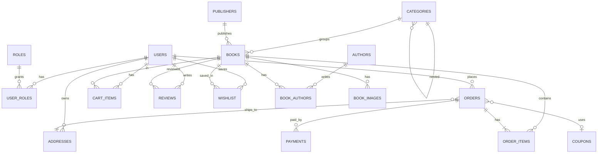
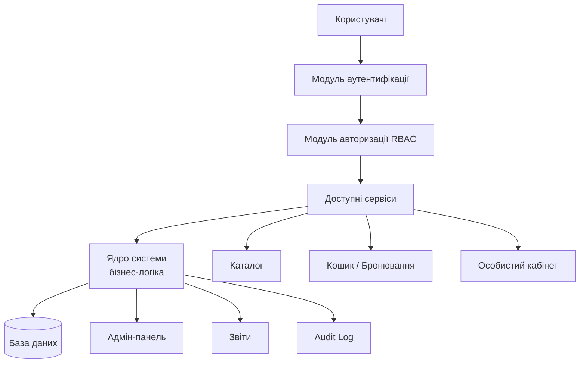
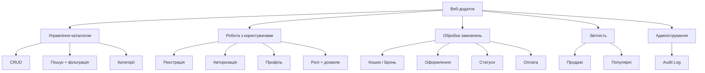
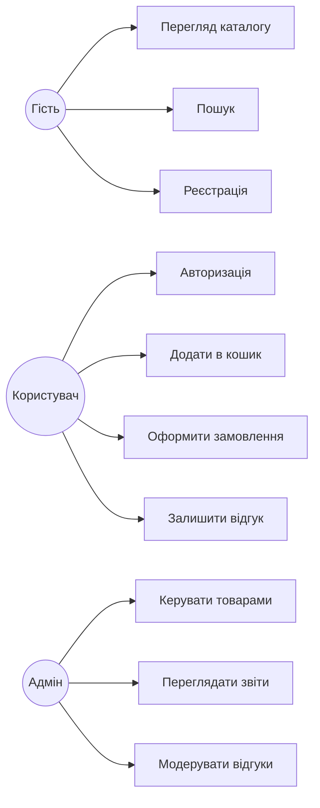
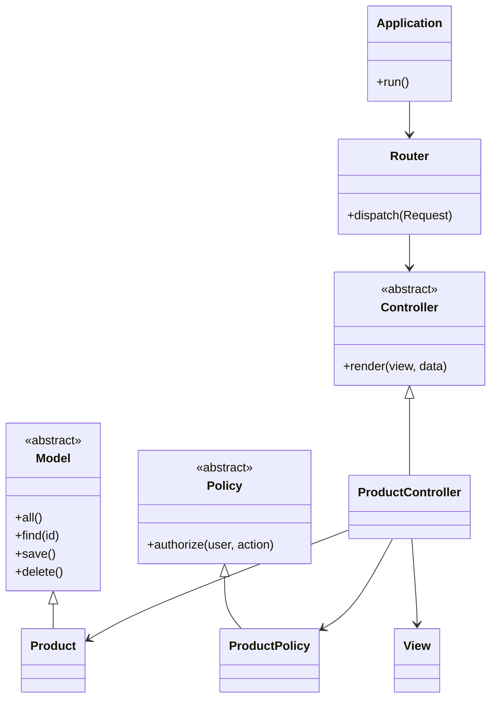

# Схеми для курсової роботи

> **Призначення:** еталонні схеми БД для розділу 2 «Проектування та розробка ПЗ».
> Базується на Додатку З методички + тематика 30 варіантів LR4.
> **Орієнтир — оцінка 5 (відмінно):** повні розширені схеми з best practices (FK, індекси, constraints, RBAC, аудит, soft delete).
>
> **Для кожної з 5 категорій** — 1-2 еталонних варіанти з повноцінною реалізацією.
> Якщо ваш варіант в категорії — адаптуйте базу до своєї тематики.

## Супровідні документи

Цей файл — **центральний індекс** курсової підготовки. Працюй з ним паралельно з матеріалами нижче:

| # | Документ | Для чого |
|---|----------|----------|
| 1 | [er-diagrams.md](er-diagrams.md) | ER-діаграми (Mermaid) для 7 референсних варіантів — візуалізація звʼязків для розділу 2 |
| 2 | [checklist-lr4.md](checklist-lr4.md) | Чекліст самоперевірки ЛР4 перед захистом (10 блоків, карта балів 60→100) |
| 3 | [typical-mistakes.md](typical-mistakes.md) | Типові помилки + скільки балів втрачають (❌/✅ з коментарями) |
| 4 | [example-queries.md](example-queries.md) | Топ SQL-запитів по категоріях для демонстрації на захисті |
| 5 | [evolution-path.md](evolution-path.md) | Роадмапа: як одна схема з ЛР4 розвивається в ЛР5 → ЛР6 → курсову |
| 6 | [migrations-seeders-example.md](migrations-seeders-example.md) | Міграції + сідери для v1 Книгарня (vanilla PHP + Laravel) |
| 7 | [feature-catalog.md](feature-catalog.md) | Каталог фіч по категоріях (що має вміти сайт) |
| 8 | [functionality-flow.md](functionality-flow.md) | Юзер-флоу: як користувач проходить сайт |
| 9 | [system-design.md](system-design.md) | Архітектура рівня «система» для курсової |
| 10 | [assignment.md](assignment.md) | Опис завдання курсової + вимоги методички |

**Рекомендований порядок читання для початку роботи над курсовою:**

1. [assignment.md](assignment.md) — зрозумій що треба здати
2. [feature-catalog.md](feature-catalog.md) + [functionality-flow.md](functionality-flow.md) — продумай фічі
3. **schemas.md** (цей файл) — вибери еталон для своєї категорії
4. [er-diagrams.md](er-diagrams.md) — візуалізуй звʼязки
5. [checklist-lr4.md](checklist-lr4.md) + [typical-mistakes.md](typical-mistakes.md) — уникай помилок
6. [migrations-seeders-example.md](migrations-seeders-example.md) — реалізуй БД
7. [example-queries.md](example-queries.md) — підготуй SQL для захисту
8. [evolution-path.md](evolution-path.md) — плануй як доростити схему до ЛР5/ЛР6/курсової

## Зміст

1. [Типи схем у курсовій](#1-типи-схем-у-курсовій)
2. [Категоризація 30 тем LR4](#2-категоризація-30-тем-lr4)
3. [Best practices для всіх схем](#3-best-practices-для-всіх-схем)
4. [E-commerce — еталон: v1 Книгарня](#4-e-commerce--еталон-v1-книгарня)
5. [E-commerce (варіація) — v4 Піцерія](#5-e-commerce-варіація--v4-піцерія)
6. [Booking — еталон: v3 Кінотеатр](#6-booking--еталон-v3-кінотеатр)
7. [Booking (варіація) — v14 Стоматологія](#7-booking-варіація--v14-стоматологія)
8. [Catalog — еталон: v7 Бібліотека](#8-catalog--еталон-v7-бібліотека)
9. [Service-order — еталон: v20 Пральня](#9-service-order--еталон-v20-пральня)
10. [UGC — еталон: v30 Кулінарний блог](#10-ugc--еталон-v30-кулінарний-блог)
11. [Наскрізні модулі (для всіх)](#11-наскрізні-модулі-для-всіх)
12. [Шаблони схем у Mermaid](#12-шаблони-схем-у-mermaid)

---

## 1. Типи схем у курсовій

Згідно з Додатком З методички — обов'язковий набір:

| # | Схема | Рис | Що показує |
|---|-------|-----|-----------|
| 1 | Структурна схема ІС | 3.1 | Модулі системи + потоки даних + користувачі → БД |
| 2 | Функціональна схема | 3.2 | Ієрархія функцій/підсистем |
| 3 | ER-діаграма (фізичний рівень) | 3.3 | Таблиці + поля + типи + PK/FK |
| 4 | ER-діаграма (логічний рівень) | 3.4 | Сутності + зв'язки без типів |
| 5 | Use Case (опційно) | — | Сценарії користувач ↔ система |
| 6 | Діаграма класів MVC (опційно) | — | Model, Controller, View |

**На 5:** всі 6 схем + повна DDL-реалізація + docstring до кожної таблиці.

---

## 2. Категоризація 30 тем LR4

Кожна тема (див. [variant-diversity.md](../../.claude/rules/variant-diversity.md#lr4-5-site-themes-30-unique)) належить до однієї з 5 категорій. **Знайдіть свій варіант → перейдіть до еталону цієї категорії → адаптуйте.**

| Категорія | Варіанти | Еталонний приклад | Ключова логіка |
|-----------|----------|------------------|----------------|
| **E-commerce** | v1, v4, v5, v10, v12, v16, v17, v21, v22, v24, v28 | v1 Книгарня, v4 Піцерія | каталог → кошик → замовлення → оплата |
| **Booking** | v2, v3, v6, v11, v13, v14, v18, v19, v26, v27, v29 | v3 Кінотеатр, v14 Стоматологія | ресурс + слот часу → бронь |
| **Catalog** | v7, v8, v15, v23, v25 | v7 Бібліотека | перегляд + фільтри + рейтинги |
| **Service-order** | v9, v20 | v20 Пральня | замовлення → статуси виконання |
| **UGC** | v30 | v30 Кулінарний блог | пости + коментарі + лайки + теги |

---

## 3. Best practices для всіх схем

Обов'язкові стандарти для оцінки 5:

1. **InnoDB + utf8mb4** — `ENGINE=InnoDB DEFAULT CHARSET=utf8mb4 COLLATE=utf8mb4_unicode_ci` для кожної таблиці.
2. **Первинні ключі** — `INT PRIMARY KEY AUTO_INCREMENT` (або `BIGINT` для великих обсягів).
3. **Зовнішні ключі** — завжди з правилами `ON DELETE` / `ON UPDATE` (CASCADE / RESTRICT / SET NULL).
4. **Індекси** — на всі колонки у `WHERE` / `JOIN` / `ORDER BY` (email, slug, foreign keys автоматично, статуси явно).
5. **UNIQUE constraints** — email, slug, isbn, номер замовлення.
6. **CHECK constraints** — діапазони (stars 1-5, price > 0).
7. **Timestamps** — `created_at`, `updated_at` на кожній таблиці.
8. **Soft delete** — `deleted_at DATETIME NULL` для бізнес-сутностей.
9. **ENUM або окрема таблиця** — для статусів (enum для <5 значень, таблиця для >5).
10. **JSON колонки** — для гнучких атрибутів (динамічні характеристики товарів).
11. **Нормалізація 3NF** — уникайте дублювання, виносьте повторення в окремі таблиці.
12. **Пароль** — тільки `password_hash` (VARCHAR(255)), ніколи plain text. `password_hash()` + `password_verify()`.

---

## 4. E-commerce — еталон: v1 Книгарня

### 4.1 Структура (16 таблиць — повний функціонал)

```
# Користувачі + RBAC
users, roles, user_roles, addresses

# Каталог
categories, publishers, authors, books, book_authors, book_images

# Продаж
cart_items, orders, order_items, payments, coupons

# Соціальне
reviews, wishlist

# Технічне
sessions, password_resets, audit_log
```

### 4.2 DDL (ключові таблиці)

```sql
-- Користувачі з роллю
CREATE TABLE users (
    id INT PRIMARY KEY AUTO_INCREMENT,
    email VARCHAR(255) NOT NULL UNIQUE,
    password_hash VARCHAR(255) NOT NULL,
    first_name VARCHAR(100) NOT NULL,
    last_name VARCHAR(100) NOT NULL,
    phone VARCHAR(20),
    email_verified_at DATETIME NULL,
    created_at DATETIME DEFAULT CURRENT_TIMESTAMP,
    updated_at DATETIME DEFAULT CURRENT_TIMESTAMP ON UPDATE CURRENT_TIMESTAMP,
    deleted_at DATETIME NULL,
    INDEX idx_email (email),
    INDEX idx_deleted (deleted_at)
) ENGINE=InnoDB DEFAULT CHARSET=utf8mb4;

CREATE TABLE roles (
    id INT PRIMARY KEY AUTO_INCREMENT,
    name VARCHAR(50) NOT NULL UNIQUE  -- admin, manager, customer
) ENGINE=InnoDB DEFAULT CHARSET=utf8mb4;

CREATE TABLE user_roles (
    user_id INT NOT NULL,
    role_id INT NOT NULL,
    PRIMARY KEY (user_id, role_id),
    FOREIGN KEY (user_id) REFERENCES users(id) ON DELETE CASCADE,
    FOREIGN KEY (role_id) REFERENCES roles(id) ON DELETE CASCADE
) ENGINE=InnoDB DEFAULT CHARSET=utf8mb4;

-- Каталог з self-reference (підкатегорії)
CREATE TABLE categories (
    id INT PRIMARY KEY AUTO_INCREMENT,
    name VARCHAR(100) NOT NULL,
    slug VARCHAR(100) NOT NULL UNIQUE,
    parent_id INT NULL,
    sort_order INT DEFAULT 0,
    FOREIGN KEY (parent_id) REFERENCES categories(id) ON DELETE SET NULL,
    INDEX idx_parent (parent_id)
) ENGINE=InnoDB DEFAULT CHARSET=utf8mb4;

CREATE TABLE publishers (
    id INT PRIMARY KEY AUTO_INCREMENT,
    name VARCHAR(150) NOT NULL,
    country VARCHAR(100),
    website VARCHAR(255)
) ENGINE=InnoDB DEFAULT CHARSET=utf8mb4;

CREATE TABLE authors (
    id INT PRIMARY KEY AUTO_INCREMENT,
    first_name VARCHAR(100) NOT NULL,
    last_name VARCHAR(100) NOT NULL,
    bio TEXT,
    photo VARCHAR(255)
) ENGINE=InnoDB DEFAULT CHARSET=utf8mb4;

CREATE TABLE books (
    id INT PRIMARY KEY AUTO_INCREMENT,
    category_id INT NOT NULL,
    publisher_id INT NULL,
    title VARCHAR(255) NOT NULL,
    slug VARCHAR(255) NOT NULL UNIQUE,
    isbn VARCHAR(20) UNIQUE,
    description TEXT,
    price DECIMAL(10,2) NOT NULL CHECK (price >= 0),
    pages INT CHECK (pages > 0),
    language VARCHAR(50),
    publication_year YEAR,
    stock INT NOT NULL DEFAULT 0 CHECK (stock >= 0),
    cover_image VARCHAR(255),
    is_featured BOOLEAN DEFAULT FALSE,
    created_at DATETIME DEFAULT CURRENT_TIMESTAMP,
    updated_at DATETIME DEFAULT CURRENT_TIMESTAMP ON UPDATE CURRENT_TIMESTAMP,
    deleted_at DATETIME NULL,
    FOREIGN KEY (category_id) REFERENCES categories(id) ON DELETE RESTRICT,
    FOREIGN KEY (publisher_id) REFERENCES publishers(id) ON DELETE SET NULL,
    INDEX idx_category (category_id),
    INDEX idx_title (title),
    INDEX idx_featured (is_featured),
    INDEX idx_deleted (deleted_at),
    FULLTEXT idx_search (title, description)
) ENGINE=InnoDB DEFAULT CHARSET=utf8mb4;

-- N↔N автори ↔ книги
CREATE TABLE book_authors (
    book_id INT NOT NULL,
    author_id INT NOT NULL,
    PRIMARY KEY (book_id, author_id),
    FOREIGN KEY (book_id) REFERENCES books(id) ON DELETE CASCADE,
    FOREIGN KEY (author_id) REFERENCES authors(id) ON DELETE CASCADE
) ENGINE=InnoDB DEFAULT CHARSET=utf8mb4;

-- Замовлення
CREATE TABLE orders (
    id INT PRIMARY KEY AUTO_INCREMENT,
    order_number VARCHAR(20) NOT NULL UNIQUE,
    user_id INT NOT NULL,
    address_id INT NULL,
    status ENUM('pending','confirmed','shipped','delivered','cancelled') DEFAULT 'pending',
    subtotal DECIMAL(10,2) NOT NULL,
    discount DECIMAL(10,2) DEFAULT 0,
    shipping_cost DECIMAL(10,2) DEFAULT 0,
    total DECIMAL(10,2) NOT NULL,
    coupon_id INT NULL,
    notes TEXT,
    created_at DATETIME DEFAULT CURRENT_TIMESTAMP,
    updated_at DATETIME DEFAULT CURRENT_TIMESTAMP ON UPDATE CURRENT_TIMESTAMP,
    FOREIGN KEY (user_id) REFERENCES users(id) ON DELETE RESTRICT,
    FOREIGN KEY (address_id) REFERENCES addresses(id) ON DELETE SET NULL,
    FOREIGN KEY (coupon_id) REFERENCES coupons(id) ON DELETE SET NULL,
    INDEX idx_user (user_id),
    INDEX idx_status (status),
    INDEX idx_created (created_at)
) ENGINE=InnoDB DEFAULT CHARSET=utf8mb4;

-- Ціна на момент замовлення (price_at_order) — щоб зміна ціни товару не змінила історію
CREATE TABLE order_items (
    id INT PRIMARY KEY AUTO_INCREMENT,
    order_id INT NOT NULL,
    book_id INT NOT NULL,
    quantity INT NOT NULL CHECK (quantity > 0),
    price_at_order DECIMAL(10,2) NOT NULL,
    FOREIGN KEY (order_id) REFERENCES orders(id) ON DELETE CASCADE,
    FOREIGN KEY (book_id) REFERENCES books(id) ON DELETE RESTRICT,
    INDEX idx_order (order_id),
    INDEX idx_book (book_id)
) ENGINE=InnoDB DEFAULT CHARSET=utf8mb4;

-- Оплата (окрема таблиця для розширення — split payments, refunds)
CREATE TABLE payments (
    id INT PRIMARY KEY AUTO_INCREMENT,
    order_id INT NOT NULL,
    amount DECIMAL(10,2) NOT NULL,
    method ENUM('card','cash','bank_transfer','liqpay') NOT NULL,
    status ENUM('pending','completed','failed','refunded') DEFAULT 'pending',
    transaction_id VARCHAR(100) UNIQUE,
    paid_at DATETIME NULL,
    created_at DATETIME DEFAULT CURRENT_TIMESTAMP,
    FOREIGN KEY (order_id) REFERENCES orders(id) ON DELETE RESTRICT,
    INDEX idx_order (order_id),
    INDEX idx_status (status)
) ENGINE=InnoDB DEFAULT CHARSET=utf8mb4;

-- Відгуки з модерацією
CREATE TABLE reviews (
    id INT PRIMARY KEY AUTO_INCREMENT,
    book_id INT NOT NULL,
    user_id INT NOT NULL,
    stars TINYINT NOT NULL CHECK (stars BETWEEN 1 AND 5),
    title VARCHAR(200),
    text TEXT,
    is_verified_purchase BOOLEAN DEFAULT FALSE,
    is_approved BOOLEAN DEFAULT FALSE,
    created_at DATETIME DEFAULT CURRENT_TIMESTAMP,
    FOREIGN KEY (book_id) REFERENCES books(id) ON DELETE CASCADE,
    FOREIGN KEY (user_id) REFERENCES users(id) ON DELETE CASCADE,
    UNIQUE KEY uq_user_book_review (user_id, book_id),
    INDEX idx_book_approved (book_id, is_approved)
) ENGINE=InnoDB DEFAULT CHARSET=utf8mb4;
```

### 4.3 ER-діаграма



**Всього:** 16 таблиць. Це повний функціонал інтернет-магазину — орієнтир для оцінки 5.

---

## 5. E-commerce (варіація) — v4 Піцерія

Додає до базового e-commerce **інгредієнти** (N↔N) та **доставку по зонах**:

### 5.1 Ключові відмінності від v1

```sql
-- Інгредієнти як окрема сутність (алергени, склад)
CREATE TABLE ingredients (
    id INT PRIMARY KEY AUTO_INCREMENT,
    name VARCHAR(100) NOT NULL UNIQUE,
    is_allergen BOOLEAN DEFAULT FALSE,
    is_vegan BOOLEAN DEFAULT FALSE
) ENGINE=InnoDB DEFAULT CHARSET=utf8mb4;

-- N↔N з додатковими атрибутами (кількість)
CREATE TABLE pizza_ingredients (
    pizza_id INT NOT NULL,
    ingredient_id INT NOT NULL,
    weight_g INT DEFAULT 0,
    is_removable BOOLEAN DEFAULT TRUE,
    PRIMARY KEY (pizza_id, ingredient_id),
    FOREIGN KEY (pizza_id) REFERENCES pizzas(id) ON DELETE CASCADE,
    FOREIGN KEY (ingredient_id) REFERENCES ingredients(id) ON DELETE RESTRICT
) ENGINE=InnoDB DEFAULT CHARSET=utf8mb4;

-- Зони доставки з різними тарифами
CREATE TABLE delivery_zones (
    id INT PRIMARY KEY AUTO_INCREMENT,
    name VARCHAR(100) NOT NULL,
    min_order DECIMAL(10,2) NOT NULL DEFAULT 0,
    delivery_fee DECIMAL(10,2) NOT NULL DEFAULT 0,
    avg_delivery_min INT DEFAULT 45
) ENGINE=InnoDB DEFAULT CHARSET=utf8mb4;

-- Кастомізація замовлення (прибрати інгредієнт)
CREATE TABLE order_item_customizations (
    id INT PRIMARY KEY AUTO_INCREMENT,
    order_item_id INT NOT NULL,
    ingredient_id INT NOT NULL,
    action ENUM('remove','extra') NOT NULL,
    FOREIGN KEY (order_item_id) REFERENCES order_items(id) ON DELETE CASCADE,
    FOREIGN KEY (ingredient_id) REFERENCES ingredients(id)
) ENGINE=InnoDB DEFAULT CHARSET=utf8mb4;
```

**Що додається:** `ingredients`, `pizza_ingredients`, `delivery_zones`, `order_item_customizations` + FK `delivery_zone_id` у `addresses` або `orders`.

**Застосовно для:** v10 Квіткова крамниця (bouquet_flowers), v24 Пекарня (pastry_allergens), v28 Ресторан (dish_ingredients).

---

## 6. Booking — еталон: v3 Кінотеатр

Ключовий виклик Booking — **запобігти подвійному бронюванню одного слоту/місця**.

### 6.1 Структура (14 таблиць)

```
users, roles, user_roles
movies, genres, movie_genres
halls, seats, seat_types
sessions, tickets, payments
reviews, audit_log
```

### 6.2 DDL (критичні таблиці)

```sql
CREATE TABLE movies (
    id INT PRIMARY KEY AUTO_INCREMENT,
    title VARCHAR(255) NOT NULL,
    slug VARCHAR(255) NOT NULL UNIQUE,
    description TEXT,
    director VARCHAR(150),
    duration_min INT NOT NULL CHECK (duration_min > 0),
    release_year YEAR,
    age_rating VARCHAR(10),  -- '0+', '12+', '16+', '18+'
    poster VARCHAR(255),
    trailer_url VARCHAR(500),
    is_active BOOLEAN DEFAULT TRUE,
    created_at DATETIME DEFAULT CURRENT_TIMESTAMP,
    INDEX idx_active (is_active),
    INDEX idx_title (title)
) ENGINE=InnoDB DEFAULT CHARSET=utf8mb4;

CREATE TABLE halls (
    id INT PRIMARY KEY AUTO_INCREMENT,
    name VARCHAR(50) NOT NULL UNIQUE,
    rows_count INT NOT NULL CHECK (rows_count > 0),
    cols_count INT NOT NULL CHECK (cols_count > 0),
    screen_type ENUM('2D','3D','IMAX','4DX') DEFAULT '2D'
) ENGINE=InnoDB DEFAULT CHARSET=utf8mb4;

CREATE TABLE seat_types (
    id INT PRIMARY KEY AUTO_INCREMENT,
    name VARCHAR(50) NOT NULL,  -- 'standard', 'premium', 'vip'
    price_multiplier DECIMAL(3,2) DEFAULT 1.00
) ENGINE=InnoDB DEFAULT CHARSET=utf8mb4;

CREATE TABLE seats (
    id INT PRIMARY KEY AUTO_INCREMENT,
    hall_id INT NOT NULL,
    type_id INT NOT NULL,
    row_num INT NOT NULL,
    col_num INT NOT NULL,
    FOREIGN KEY (hall_id) REFERENCES halls(id) ON DELETE CASCADE,
    FOREIGN KEY (type_id) REFERENCES seat_types(id) ON DELETE RESTRICT,
    UNIQUE KEY uq_hall_position (hall_id, row_num, col_num),
    INDEX idx_hall (hall_id)
) ENGINE=InnoDB DEFAULT CHARSET=utf8mb4;

-- Сеанси (фільм + зала + час)
CREATE TABLE sessions (
    id INT PRIMARY KEY AUTO_INCREMENT,
    movie_id INT NOT NULL,
    hall_id INT NOT NULL,
    start_at DATETIME NOT NULL,
    end_at DATETIME NOT NULL,
    base_price DECIMAL(10,2) NOT NULL CHECK (base_price > 0),
    status ENUM('scheduled','cancelled','completed') DEFAULT 'scheduled',
    created_at DATETIME DEFAULT CURRENT_TIMESTAMP,
    FOREIGN KEY (movie_id) REFERENCES movies(id) ON DELETE RESTRICT,
    FOREIGN KEY (hall_id) REFERENCES halls(id) ON DELETE RESTRICT,
    UNIQUE KEY uq_hall_time (hall_id, start_at),  -- один сеанс у залі в момент часу
    INDEX idx_movie (movie_id),
    INDEX idx_start (start_at)
) ENGINE=InnoDB DEFAULT CHARSET=utf8mb4;

-- КРИТИЧНО: UNIQUE (session_id, seat_id) запобігає подвійному бронюванню
CREATE TABLE tickets (
    id INT PRIMARY KEY AUTO_INCREMENT,
    session_id INT NOT NULL,
    seat_id INT NOT NULL,
    user_id INT NOT NULL,
    price DECIMAL(10,2) NOT NULL,
    status ENUM('reserved','paid','cancelled','used') DEFAULT 'reserved',
    reserved_at DATETIME DEFAULT CURRENT_TIMESTAMP,
    paid_at DATETIME NULL,
    qr_code VARCHAR(255) UNIQUE,
    FOREIGN KEY (session_id) REFERENCES sessions(id) ON DELETE CASCADE,
    FOREIGN KEY (seat_id) REFERENCES seats(id) ON DELETE RESTRICT,
    FOREIGN KEY (user_id) REFERENCES users(id) ON DELETE RESTRICT,
    UNIQUE KEY uq_session_seat (session_id, seat_id),  -- ⭐ запобігання race condition
    INDEX idx_user (user_id),
    INDEX idx_status (status)
) ENGINE=InnoDB DEFAULT CHARSET=utf8mb4;
```

### 6.3 Робота з race condition (best practice)

```php
// PHP: бронювання з транзакцією + UNIQUE
try {
    $db->beginTransaction();
    $stmt = $db->prepare("
        INSERT INTO tickets (session_id, seat_id, user_id, price, status)
        VALUES (?, ?, ?, ?, 'reserved')
    ");
    $stmt->execute([$sessionId, $seatId, $userId, $price]);
    $db->commit();
} catch (PDOException $e) {
    $db->rollBack();
    // UNIQUE violation → місце вже зайняте
    if ($e->getCode() == 23000) {
        throw new SeatAlreadyBookedException();
    }
    throw $e;
}
```

**Застосовно для:** v27 Театр (shows + seats + tickets), v2 Фітнес-клуб (class_schedules), v26 Хостел (beds + bookings).

---

## 7. Booking (варіація) — v14 Стоматологія

Додає до базового Booking **медичні записи** (історія хвороби) + **розділення user/patient** (один акаунт може бронювати для дітей).

### 7.1 Ключові сутності

```sql
-- Пацієнт ≠ користувач: один user може мати кількох patient (дитина, чоловік)
CREATE TABLE patients (
    id INT PRIMARY KEY AUTO_INCREMENT,
    user_id INT NOT NULL,
    first_name VARCHAR(100) NOT NULL,
    last_name VARCHAR(100) NOT NULL,
    birth_date DATE NOT NULL,
    gender ENUM('male','female') NOT NULL,
    insurance_number VARCHAR(50),
    FOREIGN KEY (user_id) REFERENCES users(id) ON DELETE CASCADE,
    INDEX idx_user (user_id)
) ENGINE=InnoDB DEFAULT CHARSET=utf8mb4;

CREATE TABLE doctors (
    id INT PRIMARY KEY AUTO_INCREMENT,
    first_name VARCHAR(100) NOT NULL,
    last_name VARCHAR(100) NOT NULL,
    specialty VARCHAR(100) NOT NULL,  -- терапевт, ортодонт, хірург
    experience_years INT,
    photo VARCHAR(255),
    is_active BOOLEAN DEFAULT TRUE
) ENGINE=InnoDB DEFAULT CHARSET=utf8mb4;

-- Робочий графік лікаря по днях тижня
CREATE TABLE doctor_schedules (
    id INT PRIMARY KEY AUTO_INCREMENT,
    doctor_id INT NOT NULL,
    weekday TINYINT NOT NULL CHECK (weekday BETWEEN 1 AND 7),
    start_time TIME NOT NULL,
    end_time TIME NOT NULL,
    slot_duration_min INT DEFAULT 30,
    FOREIGN KEY (doctor_id) REFERENCES doctors(id) ON DELETE CASCADE,
    UNIQUE KEY uq_doctor_weekday (doctor_id, weekday)
) ENGINE=InnoDB DEFAULT CHARSET=utf8mb4;

CREATE TABLE appointments (
    id INT PRIMARY KEY AUTO_INCREMENT,
    patient_id INT NOT NULL,
    doctor_id INT NOT NULL,
    service_id INT NOT NULL,
    scheduled_at DATETIME NOT NULL,
    duration_min INT NOT NULL,
    status ENUM('scheduled','confirmed','completed','cancelled','no_show') DEFAULT 'scheduled',
    notes TEXT,
    created_at DATETIME DEFAULT CURRENT_TIMESTAMP,
    FOREIGN KEY (patient_id) REFERENCES patients(id) ON DELETE RESTRICT,
    FOREIGN KEY (doctor_id) REFERENCES doctors(id) ON DELETE RESTRICT,
    FOREIGN KEY (service_id) REFERENCES services(id) ON DELETE RESTRICT,
    UNIQUE KEY uq_doctor_time (doctor_id, scheduled_at),  -- запобігання накладок
    INDEX idx_patient (patient_id),
    INDEX idx_status (status),
    INDEX idx_scheduled (scheduled_at)
) ENGINE=InnoDB DEFAULT CHARSET=utf8mb4;

-- Медична історія (окрема таблиця — для повноти record)
CREATE TABLE medical_records (
    id INT PRIMARY KEY AUTO_INCREMENT,
    patient_id INT NOT NULL,
    appointment_id INT NULL,
    diagnosis TEXT NOT NULL,
    treatment TEXT,
    recorded_at DATETIME DEFAULT CURRENT_TIMESTAMP,
    doctor_id INT NOT NULL,
    FOREIGN KEY (patient_id) REFERENCES patients(id) ON DELETE RESTRICT,
    FOREIGN KEY (appointment_id) REFERENCES appointments(id) ON DELETE SET NULL,
    FOREIGN KEY (doctor_id) REFERENCES doctors(id) ON DELETE RESTRICT,
    INDEX idx_patient (patient_id)
) ENGINE=InnoDB DEFAULT CHARSET=utf8mb4;

CREATE TABLE prescriptions (
    id INT PRIMARY KEY AUTO_INCREMENT,
    record_id INT NOT NULL,
    medicine_name VARCHAR(200) NOT NULL,
    dosage VARCHAR(100),
    duration_days INT,
    FOREIGN KEY (record_id) REFERENCES medical_records(id) ON DELETE CASCADE
) ENGINE=InnoDB DEFAULT CHARSET=utf8mb4;
```

**Застосовно для:** v6 Ветклініка (animals замість patients), v18 Барбершоп (без medical_records, з masters + services).

---

## 8. Catalog — еталон: v7 Бібліотека

Catalog без покупки — **видача примірників** + рейтинги + обране + резервування.

### 8.1 DDL

```sql
CREATE TABLE journals (
    id INT PRIMARY KEY AUTO_INCREMENT,
    title VARCHAR(255) NOT NULL,
    slug VARCHAR(255) NOT NULL UNIQUE,
    publisher_id INT,
    category_id INT NOT NULL,
    isbn VARCHAR(20) UNIQUE,
    publication_year YEAR,
    pages INT CHECK (pages > 0),
    language VARCHAR(50),
    cover VARCHAR(255),
    copies_total INT NOT NULL DEFAULT 0 CHECK (copies_total >= 0),
    copies_available INT NOT NULL DEFAULT 0 CHECK (copies_available >= 0),
    created_at DATETIME DEFAULT CURRENT_TIMESTAMP,
    FOREIGN KEY (publisher_id) REFERENCES publishers(id) ON DELETE SET NULL,
    FOREIGN KEY (category_id) REFERENCES categories(id) ON DELETE RESTRICT,
    INDEX idx_category (category_id),
    INDEX idx_available (copies_available),
    FULLTEXT idx_search (title)
) ENGINE=InnoDB DEFAULT CHARSET=utf8mb4;

-- Конкретні примірники (на випадок інвентаризації)
CREATE TABLE journal_copies (
    id INT PRIMARY KEY AUTO_INCREMENT,
    journal_id INT NOT NULL,
    inventory_number VARCHAR(50) NOT NULL UNIQUE,
    condition_rating ENUM('new','good','worn','damaged') DEFAULT 'good',
    is_available BOOLEAN DEFAULT TRUE,
    FOREIGN KEY (journal_id) REFERENCES journals(id) ON DELETE CASCADE,
    INDEX idx_journal (journal_id)
) ENGINE=InnoDB DEFAULT CHARSET=utf8mb4;

-- Видача
CREATE TABLE loans (
    id INT PRIMARY KEY AUTO_INCREMENT,
    copy_id INT NOT NULL,
    user_id INT NOT NULL,
    loaned_at DATETIME DEFAULT CURRENT_TIMESTAMP,
    due_at DATETIME NOT NULL,
    returned_at DATETIME NULL,
    is_returned BOOLEAN GENERATED ALWAYS AS (returned_at IS NOT NULL) STORED,
    fine_amount DECIMAL(10,2) DEFAULT 0,
    FOREIGN KEY (copy_id) REFERENCES journal_copies(id) ON DELETE RESTRICT,
    FOREIGN KEY (user_id) REFERENCES users(id) ON DELETE RESTRICT,
    INDEX idx_user (user_id),
    INDEX idx_due (due_at),
    INDEX idx_returned (is_returned)
) ENGINE=InnoDB DEFAULT CHARSET=utf8mb4;

-- Резервування (черга на зайняту книгу)
CREATE TABLE reservations (
    id INT PRIMARY KEY AUTO_INCREMENT,
    journal_id INT NOT NULL,
    user_id INT NOT NULL,
    reserved_at DATETIME DEFAULT CURRENT_TIMESTAMP,
    expires_at DATETIME NULL,
    status ENUM('active','fulfilled','expired','cancelled') DEFAULT 'active',
    FOREIGN KEY (journal_id) REFERENCES journals(id) ON DELETE CASCADE,
    FOREIGN KEY (user_id) REFERENCES users(id) ON DELETE CASCADE,
    INDEX idx_journal_status (journal_id, status),
    INDEX idx_user (user_id)
) ENGINE=InnoDB DEFAULT CHARSET=utf8mb4;

CREATE TABLE favorites (
    user_id INT NOT NULL,
    journal_id INT NOT NULL,
    added_at DATETIME DEFAULT CURRENT_TIMESTAMP,
    PRIMARY KEY (user_id, journal_id),
    FOREIGN KEY (user_id) REFERENCES users(id) ON DELETE CASCADE,
    FOREIGN KEY (journal_id) REFERENCES journals(id) ON DELETE CASCADE
) ENGINE=InnoDB DEFAULT CHARSET=utf8mb4;
```

**Застосовно для:** v8 Музична школа (instruments + rentals), v25 Музей (exhibits + tours + ticket_sales).

---

## 9. Service-order — еталон: v20 Пральня

Замовлення послуги з **повною історією статусів** (audit trail).

### 9.1 DDL

```sql
CREATE TABLE services (
    id INT PRIMARY KEY AUTO_INCREMENT,
    name VARCHAR(150) NOT NULL,
    description TEXT,
    base_price DECIMAL(10,2) NOT NULL CHECK (base_price >= 0),
    price_per_kg DECIMAL(10,2) DEFAULT 0,
    duration_hours INT NOT NULL,
    is_active BOOLEAN DEFAULT TRUE,
    INDEX idx_active (is_active)
) ENGINE=InnoDB DEFAULT CHARSET=utf8mb4;

CREATE TABLE orders (
    id INT PRIMARY KEY AUTO_INCREMENT,
    order_number VARCHAR(20) NOT NULL UNIQUE,
    user_id INT NOT NULL,
    weight_kg DECIMAL(6,2) CHECK (weight_kg > 0),
    total DECIMAL(10,2) NOT NULL,
    current_status ENUM('new','accepted','in_progress','ready','delivered','cancelled') DEFAULT 'new',
    notes TEXT,
    created_at DATETIME DEFAULT CURRENT_TIMESTAMP,
    expected_ready_at DATETIME NULL,
    delivered_at DATETIME NULL,
    FOREIGN KEY (user_id) REFERENCES users(id) ON DELETE RESTRICT,
    INDEX idx_user (user_id),
    INDEX idx_status (current_status),
    INDEX idx_created (created_at)
) ENGINE=InnoDB DEFAULT CHARSET=utf8mb4;

CREATE TABLE order_items (
    id INT PRIMARY KEY AUTO_INCREMENT,
    order_id INT NOT NULL,
    service_id INT NOT NULL,
    quantity INT DEFAULT 1,
    weight_kg DECIMAL(6,2) DEFAULT 0,
    price DECIMAL(10,2) NOT NULL,
    FOREIGN KEY (order_id) REFERENCES orders(id) ON DELETE CASCADE,
    FOREIGN KEY (service_id) REFERENCES services(id) ON DELETE RESTRICT,
    INDEX idx_order (order_id)
) ENGINE=InnoDB DEFAULT CHARSET=utf8mb4;

-- Критичне: повна історія змін статусів (хто, коли, чому)
CREATE TABLE order_status_log (
    id INT PRIMARY KEY AUTO_INCREMENT,
    order_id INT NOT NULL,
    old_status VARCHAR(30),
    new_status VARCHAR(30) NOT NULL,
    changed_by INT NULL,
    reason TEXT,
    changed_at DATETIME DEFAULT CURRENT_TIMESTAMP,
    FOREIGN KEY (order_id) REFERENCES orders(id) ON DELETE CASCADE,
    FOREIGN KEY (changed_by) REFERENCES users(id) ON DELETE SET NULL,
    INDEX idx_order (order_id),
    INDEX idx_changed (changed_at)
) ENGINE=InnoDB DEFAULT CHARSET=utf8mb4;

CREATE TABLE pickups (
    id INT PRIMARY KEY AUTO_INCREMENT,
    order_id INT NOT NULL,
    type ENUM('pickup','delivery') NOT NULL,
    address TEXT NOT NULL,
    scheduled_at DATETIME NOT NULL,
    completed_at DATETIME NULL,
    courier_id INT NULL,
    FOREIGN KEY (order_id) REFERENCES orders(id) ON DELETE CASCADE,
    FOREIGN KEY (courier_id) REFERENCES users(id) ON DELETE SET NULL,
    INDEX idx_order (order_id),
    INDEX idx_scheduled (scheduled_at)
) ENGINE=InnoDB DEFAULT CHARSET=utf8mb4;
```

### 9.2 Trigger для автоматичного логування статусів

```sql
DELIMITER //
CREATE TRIGGER log_order_status_change
AFTER UPDATE ON orders
FOR EACH ROW
BEGIN
    IF OLD.current_status != NEW.current_status THEN
        INSERT INTO order_status_log (order_id, old_status, new_status, changed_at)
        VALUES (NEW.id, OLD.current_status, NEW.current_status, NOW());
    END IF;
END//
DELIMITER ;
```

**Застосовно для:** v9 Фотостудія (photosessions + status log).

---

## 10. UGC — еталон: v30 Кулінарний блог

UGC — **пости + коментарі з вкладеністю + лайки + теги + модерація**.

### 10.1 DDL

```sql
CREATE TABLE recipes (
    id INT PRIMARY KEY AUTO_INCREMENT,
    user_id INT NOT NULL,
    category_id INT NOT NULL,
    title VARCHAR(255) NOT NULL,
    slug VARCHAR(255) NOT NULL UNIQUE,
    description TEXT,
    cooking_time_min INT NOT NULL CHECK (cooking_time_min > 0),
    servings INT NOT NULL CHECK (servings > 0),
    difficulty ENUM('easy','medium','hard') DEFAULT 'medium',
    main_image VARCHAR(255),
    status ENUM('draft','published','archived') DEFAULT 'draft',
    published_at DATETIME NULL,
    views_count INT DEFAULT 0,
    created_at DATETIME DEFAULT CURRENT_TIMESTAMP,
    updated_at DATETIME DEFAULT CURRENT_TIMESTAMP ON UPDATE CURRENT_TIMESTAMP,
    deleted_at DATETIME NULL,
    FOREIGN KEY (user_id) REFERENCES users(id) ON DELETE RESTRICT,
    FOREIGN KEY (category_id) REFERENCES categories(id) ON DELETE RESTRICT,
    INDEX idx_user (user_id),
    INDEX idx_status_published (status, published_at),
    INDEX idx_category (category_id),
    FULLTEXT idx_search (title, description)
) ENGINE=InnoDB DEFAULT CHARSET=utf8mb4;

CREATE TABLE ingredients (
    id INT PRIMARY KEY AUTO_INCREMENT,
    name VARCHAR(150) NOT NULL UNIQUE,
    unit VARCHAR(20) NOT NULL  -- г, мл, шт, ч.л.
) ENGINE=InnoDB DEFAULT CHARSET=utf8mb4;

CREATE TABLE recipe_ingredients (
    recipe_id INT NOT NULL,
    ingredient_id INT NOT NULL,
    amount DECIMAL(10,2) NOT NULL,
    is_optional BOOLEAN DEFAULT FALSE,
    PRIMARY KEY (recipe_id, ingredient_id),
    FOREIGN KEY (recipe_id) REFERENCES recipes(id) ON DELETE CASCADE,
    FOREIGN KEY (ingredient_id) REFERENCES ingredients(id) ON DELETE RESTRICT
) ENGINE=InnoDB DEFAULT CHARSET=utf8mb4;

CREATE TABLE recipe_steps (
    id INT PRIMARY KEY AUTO_INCREMENT,
    recipe_id INT NOT NULL,
    sort_order INT NOT NULL,
    description TEXT NOT NULL,
    image VARCHAR(255),
    FOREIGN KEY (recipe_id) REFERENCES recipes(id) ON DELETE CASCADE,
    UNIQUE KEY uq_recipe_order (recipe_id, sort_order),
    INDEX idx_recipe (recipe_id)
) ENGINE=InnoDB DEFAULT CHARSET=utf8mb4;

CREATE TABLE tags (
    id INT PRIMARY KEY AUTO_INCREMENT,
    name VARCHAR(50) NOT NULL UNIQUE,
    slug VARCHAR(50) NOT NULL UNIQUE
) ENGINE=InnoDB DEFAULT CHARSET=utf8mb4;

CREATE TABLE recipe_tags (
    recipe_id INT NOT NULL,
    tag_id INT NOT NULL,
    PRIMARY KEY (recipe_id, tag_id),
    FOREIGN KEY (recipe_id) REFERENCES recipes(id) ON DELETE CASCADE,
    FOREIGN KEY (tag_id) REFERENCES tags(id) ON DELETE CASCADE
) ENGINE=InnoDB DEFAULT CHARSET=utf8mb4;

-- Вкладені коментарі (self-reference)
CREATE TABLE comments (
    id INT PRIMARY KEY AUTO_INCREMENT,
    recipe_id INT NOT NULL,
    user_id INT NOT NULL,
    parent_id INT NULL,
    text TEXT NOT NULL,
    is_approved BOOLEAN DEFAULT TRUE,
    created_at DATETIME DEFAULT CURRENT_TIMESTAMP,
    deleted_at DATETIME NULL,
    FOREIGN KEY (recipe_id) REFERENCES recipes(id) ON DELETE CASCADE,
    FOREIGN KEY (user_id) REFERENCES users(id) ON DELETE CASCADE,
    FOREIGN KEY (parent_id) REFERENCES comments(id) ON DELETE CASCADE,
    INDEX idx_recipe (recipe_id),
    INDEX idx_parent (parent_id)
) ENGINE=InnoDB DEFAULT CHARSET=utf8mb4;

-- Лайки (user + recipe унікальна пара)
CREATE TABLE likes (
    user_id INT NOT NULL,
    recipe_id INT NOT NULL,
    created_at DATETIME DEFAULT CURRENT_TIMESTAMP,
    PRIMARY KEY (user_id, recipe_id),
    FOREIGN KEY (user_id) REFERENCES users(id) ON DELETE CASCADE,
    FOREIGN KEY (recipe_id) REFERENCES recipes(id) ON DELETE CASCADE,
    INDEX idx_recipe (recipe_id)
) ENGINE=InnoDB DEFAULT CHARSET=utf8mb4;

CREATE TABLE bookmarks (
    user_id INT NOT NULL,
    recipe_id INT NOT NULL,
    created_at DATETIME DEFAULT CURRENT_TIMESTAMP,
    PRIMARY KEY (user_id, recipe_id),
    FOREIGN KEY (user_id) REFERENCES users(id) ON DELETE CASCADE,
    FOREIGN KEY (recipe_id) REFERENCES recipes(id) ON DELETE CASCADE
) ENGINE=InnoDB DEFAULT CHARSET=utf8mb4;

-- Підписки (N↔N: користувач ↔ автор)
CREATE TABLE follows (
    follower_id INT NOT NULL,
    followed_id INT NOT NULL,
    created_at DATETIME DEFAULT CURRENT_TIMESTAMP,
    PRIMARY KEY (follower_id, followed_id),
    FOREIGN KEY (follower_id) REFERENCES users(id) ON DELETE CASCADE,
    FOREIGN KEY (followed_id) REFERENCES users(id) ON DELETE CASCADE,
    CHECK (follower_id != followed_id)
) ENGINE=InnoDB DEFAULT CHARSET=utf8mb4;
```

---

## 11. Наскрізні модулі (для всіх)

Додайте до будь-якої з категорій — обов'язково для оцінки 5:

### 11.1 RBAC (Role-Based Access Control)

```sql
CREATE TABLE roles (
    id INT PRIMARY KEY AUTO_INCREMENT,
    name VARCHAR(50) NOT NULL UNIQUE,
    description VARCHAR(255)
) ENGINE=InnoDB DEFAULT CHARSET=utf8mb4;

CREATE TABLE permissions (
    id INT PRIMARY KEY AUTO_INCREMENT,
    name VARCHAR(100) NOT NULL UNIQUE  -- 'books.create', 'orders.view_any'
) ENGINE=InnoDB DEFAULT CHARSET=utf8mb4;

CREATE TABLE role_permissions (
    role_id INT NOT NULL,
    permission_id INT NOT NULL,
    PRIMARY KEY (role_id, permission_id),
    FOREIGN KEY (role_id) REFERENCES roles(id) ON DELETE CASCADE,
    FOREIGN KEY (permission_id) REFERENCES permissions(id) ON DELETE CASCADE
) ENGINE=InnoDB DEFAULT CHARSET=utf8mb4;

CREATE TABLE user_roles (
    user_id INT NOT NULL,
    role_id INT NOT NULL,
    PRIMARY KEY (user_id, role_id),
    FOREIGN KEY (user_id) REFERENCES users(id) ON DELETE CASCADE,
    FOREIGN KEY (role_id) REFERENCES roles(id) ON DELETE CASCADE
) ENGINE=InnoDB DEFAULT CHARSET=utf8mb4;
```

### 11.2 Audit log

```sql
CREATE TABLE audit_log (
    id BIGINT PRIMARY KEY AUTO_INCREMENT,
    user_id INT NULL,
    action VARCHAR(50) NOT NULL,  -- 'create','update','delete','login'
    entity_type VARCHAR(50),       -- 'book','order','user'
    entity_id INT,
    old_values JSON,
    new_values JSON,
    ip_address VARCHAR(45),
    user_agent VARCHAR(500),
    created_at DATETIME DEFAULT CURRENT_TIMESTAMP,
    FOREIGN KEY (user_id) REFERENCES users(id) ON DELETE SET NULL,
    INDEX idx_user (user_id),
    INDEX idx_entity (entity_type, entity_id),
    INDEX idx_created (created_at)
) ENGINE=InnoDB DEFAULT CHARSET=utf8mb4;
```

### 11.3 Технічні таблиці

```sql
-- Токени для скидання паролів
CREATE TABLE password_resets (
    id INT PRIMARY KEY AUTO_INCREMENT,
    user_id INT NOT NULL,
    token VARCHAR(100) NOT NULL UNIQUE,
    expires_at DATETIME NOT NULL,
    used_at DATETIME NULL,
    FOREIGN KEY (user_id) REFERENCES users(id) ON DELETE CASCADE,
    INDEX idx_token (token)
) ENGINE=InnoDB DEFAULT CHARSET=utf8mb4;

-- Захист від брутфорсу
CREATE TABLE login_attempts (
    id BIGINT PRIMARY KEY AUTO_INCREMENT,
    email VARCHAR(255),
    ip_address VARCHAR(45),
    success BOOLEAN,
    attempted_at DATETIME DEFAULT CURRENT_TIMESTAMP,
    INDEX idx_ip_time (ip_address, attempted_at),
    INDEX idx_email_time (email, attempted_at)
) ENGINE=InnoDB DEFAULT CHARSET=utf8mb4;

-- Key-value конфігурація
CREATE TABLE settings (
    key_name VARCHAR(100) PRIMARY KEY,
    value TEXT,
    updated_at DATETIME DEFAULT CURRENT_TIMESTAMP ON UPDATE CURRENT_TIMESTAMP
) ENGINE=InnoDB DEFAULT CHARSET=utf8mb4;
```

---

## 12. Шаблони схем у Mermaid

### 12.1 Структурна схема ІС (Рис 3.1)



### 12.2 Функціональна схема (Рис 3.2)



### 12.3 Use Case



### 12.4 Діаграма класів MVC



---

## Посилання

**Супровідні документи курсової:**

- [er-diagrams.md](er-diagrams.md) — Mermaid ER-діаграми для 7 референсних варіантів
- [checklist-lr4.md](checklist-lr4.md) — чекліст самоперевірки перед захистом ЛР4
- [typical-mistakes.md](typical-mistakes.md) — типові помилки + скільки балів втрачають
- [example-queries.md](example-queries.md) — топ SQL-запитів для захисту
- [evolution-path.md](evolution-path.md) — як схема росте ЛР4 → ЛР5 → ЛР6 → курсова
- [migrations-seeders-example.md](migrations-seeders-example.md) — міграції + сідери (vanilla + Laravel)

**Базова документація:**

- [assignment.md](assignment.md) — загальне завдання курсової
- [feature-catalog.md](feature-catalog.md) — каталог функціональних можливостей
- [functionality-flow.md](functionality-flow.md) — юзер-флоу через сайт
- [system-design.md](system-design.md) — архітектурні рішення
- [v31.md](../lr5/variants/v31.md) — референсна реалізація MVC на vanilla PHP
- [variant-diversity.md](../../.claude/rules/variant-diversity.md) — матриця 30 варіантів
- Методичка: [Метод_реком_бекенд122.pdf](Метод_реком_бекенд122.pdf) — Додаток З (приклади схем), Додаток И (теми)

## Орієнтир оцінювання

| Оцінка | Що реалізовано |
|--------|----------------|
| **60–74** | 1 базова схема (5–7 таблиць) + 3 обов'язкові діаграми |
| **75–89** | Базова + 3–4 розширення + Use Case |
| **90–100** | **Повний еталон цієї категорії** (як у §4–10): RBAC + audit_log + soft delete + індекси + UNIQUE constraints + triggers + діаграма класів MVC |

**Орієнтир розміру БД:**
- Vanilla PHP MVC (як [v31](../lr5/variants/v31.md)) — 10–16 таблиць
- Laravel — 15–25 таблиць (Eloquent + міграції прискорюють роботу)
