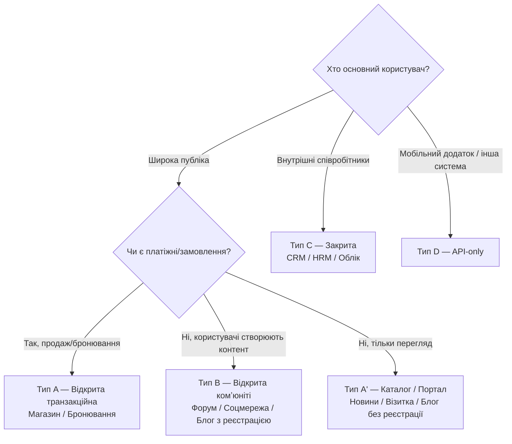

# Покрокова інструкція побудови системи (курсова)

> **Про цей файл:** що саме будувати, які блоки обовʼязкові, як організувати код та документацію. НЕ про пояснювальну записку — це про сам проект.
>
> **Перед кодом** — пройдіть [functionality-flow.md](functionality-flow.md) (тип системи + обов'язкові блоки) і переглянте [feature-catalog.md](feature-catalog.md) (меню фіч: min / extended / advanced).
>
> Методичка (ПЗ) → [Метод_реком_бекенд122.pdf](Метод_реком_бекенд122.pdf). Опис вимог до здачі → [assignment.md](assignment.md).

---

## 0. З чого починати — 3 рішення перед кодом

| Крок | Питання | Результат |
|------|---------|-----------|
| 1 | Яка тема? (з [Додатку И](Метод_реком_бекенд122.pdf) або своя) | Назва системи |
| 2 | Який тип доступу? (див. § 1) | Тип A/B/C/D |
| 3 | Laravel чи vanilla PHP? (див. § 7) | Стек |

Тільки після цих 3 рішень — БД → міграції → код.

---

## 1. Класифікація системи — flow для вибору типу



**4 типи = 4 різні набори обовʼязкових блоків.** Вибрали тип → йдіть у § 3.

---

## 2. Ролі за типами

| Тип | Гість | Користувач | Менеджер/Модератор | Адмін |
|-----|-------|------------|--------------------|-------|
| A. Магазин | ✓ (огляд + кошик) | ✓ (замовлення) | — (опц. оператор) | ✓ |
| A'. Каталог/портал | ✓ (огляд) | — або опц. (підписка) | — | ✓ (контент) |
| B. Комʼюніті | ✓ (обмежено) | ✓ (створює контент) | ✓ (модерація) | ✓ |
| C. Закрита (CRM) | — | ✓ (свої дані) | ✓ (команда) | ✓ |
| D. API | Token guest (опц.) | Token user | — | Token admin + окрема панель |

**Ролі в БД:** поле `users.role` (enum) АБО окрема таблиця `roles` + pivot. Для курсової достатньо enum: `admin`, `manager`, `user`.

---

## 3. Обовʼязкові блоки за типом

### 3.A Тип A — Відкрита транзакційна (магазин, бронювання)

#### Сторінки / модулі

| Блок | Гість | Юзер | Адмін | Примітка |
|------|-------|------|-------|----------|
| Головна (banner + popular) | ✓ | ✓ | ✓ | |
| Каталог (list) | ✓ | ✓ | ✓ | пагінація обовʼязково |
| Пошук + фільтр (категорія, ціна) | ✓ | ✓ | ✓ | GET-параметри |
| Сторінка товару | ✓ | ✓ | ✓ | |
| Кошик | ✓ (session) | ✓ (БД) | — | гостьовий кошик → при логіні злити в БД |
| Оформлення замовлення | — | ✓ | — | адреса, телефон |
| Мої замовлення + статус | — | ✓ | — | |
| Реєстрація / Логін / Logout | ✓ | — | — | Breeze |
| Профіль (edit) | — | ✓ | ✓ | |
| Контакти + Про нас | ✓ | ✓ | ✓ | статичні |
| **Admin Dashboard** | — | — | ✓ | лічильники |
| **Admin: CRUD товарів** | — | — | ✓ | upload image |
| **Admin: CRUD категорій** | — | — | ✓ | parent_id для дерева (опц.) |
| **Admin: замовлення (статуси)** | — | — | ✓ | new → paid → shipped → done |
| **Admin: користувачі** | — | — | ✓ | блокування |

#### БД (мінімум 5 таблиць з FK)

```
users(id, name, email, password, phone, address, role, created_at)
categories(id, name, slug, parent_id FK nullable)
products(id, category_id FK, name, slug, description, price, stock, image, is_active)
orders(id, user_id FK, status, total, shipping_address, created_at)
order_items(id, order_id FK, product_id FK, quantity, price_at_moment)
```

Опціонально: `reviews`, `favorites`, `addresses`, `payments`, `coupons`.

---

### 3.A' Тип A' — Каталог/портал (новини, візитка, блог-read)

#### Блоки

| Блок | Гість | Редактор | Адмін |
|------|-------|----------|-------|
| Головна | ✓ | ✓ | ✓ |
| Список статей/новин | ✓ | ✓ | ✓ |
| Стаття (детальна) | ✓ | ✓ | ✓ |
| Категорії / теги | ✓ | ✓ | ✓ |
| Пошук | ✓ | ✓ | ✓ |
| Коментарі (опц.) | ✓ (з email) | ✓ | ✓ |
| Підписка на розсилку (опц.) | ✓ | — | — |
| Контакти (форма) | ✓ | — | — |
| CRUD статей | — | ✓ | ✓ |
| Модерація коментарів | — | — | ✓ |
| CRUD користувачів-редакторів | — | — | ✓ |

#### БД

```
users(role: editor/admin)
posts(id, user_id FK, category_id FK, title, slug, excerpt, body, image, published_at)
categories(id, name, slug)
comments(id, post_id FK, name, email, body, approved)
subscribers(id, email, confirmed_at)  -- опц.
contact_messages(id, name, email, subject, body, read_at)
```

---

### 3.B Тип B — Комʼюніті (форум, соцмережа, дошка оголошень)

| Блок | Гість | Юзер | Модератор | Адмін |
|------|-------|------|-----------|-------|
| Стрічка / список постів | ✓ | ✓ | ✓ | ✓ |
| Пост / тема | ✓ | ✓ | ✓ | ✓ |
| Створити пост | — | ✓ | ✓ | ✓ |
| Редагувати свій пост | — | ✓ | ✓ | ✓ |
| Редагувати ЧУЖИЙ пост | — | — | ✓ | ✓ |
| Видалити пост | — | свій | ✓ | ✓ |
| Коментар | — | ✓ | ✓ | ✓ |
| Лайк / підписка | — | ✓ | ✓ | ✓ |
| Скарга на контент | — | ✓ | ✓ (бачить) | ✓ |
| Бан користувача | — | — | ✓ | ✓ |
| Ролі (призначити модератора) | — | — | — | ✓ |

Використати **Policy** в Laravel — автор може редагувати свій пост, модератор будь-який.

#### БД

```
users(role)
posts(id, user_id FK, category_id FK, title, body, created_at)
comments(id, post_id FK, user_id FK, body)
likes(id, user_id FK, post_id FK)  -- composite unique
reports(id, reporter_id FK, post_id FK nullable, comment_id FK nullable, reason, resolved_at)
bans(id, user_id FK, admin_id FK, reason, until)
```

---

### 3.C Тип C — Закрита внутрішня (CRM, HRM, облік)

**Без гостьового доступу. Логін на головній сторінці.**

| Блок | Юзер | Менеджер | Адмін |
|------|------|----------|-------|
| Логін (головна) | ✓ | ✓ | ✓ |
| Dashboard (особисті метрики) | ✓ | ✓ | ✓ |
| Мої записи (клієнти / задачі / співробітники) | ✓ | ✓ | ✓ |
| CRUD своїх записів | ✓ | ✓ | ✓ |
| Чужі записи (команди) | — | ✓ | ✓ |
| Переназначити виконавця | — | ✓ | ✓ |
| Звіти / експорт (CSV/PDF) | — | ✓ | ✓ |
| Управління користувачами | — | — | ✓ |
| Довідники (типи, статуси, etc.) | — | — | ✓ |
| Логи / аудит | — | — | ✓ (опц.) |

#### БД (приклад CRM)

```
users(role, department_id FK)
departments(id, name, head_id FK)
clients(id, assigned_to FK -> users, name, email, phone, status)
deals(id, client_id FK, assigned_to FK, title, amount, stage, expected_close)
tasks(id, user_id FK, deal_id FK nullable, title, due_at, done_at)
```

---

### 3.D Тип D — API-only (headless)

- Auth: **Laravel Sanctum** (token) або Passport (OAuth)
- Всі маршрути в `routes/api.php`
- Контролери повертають `JsonResource` (не Blade)
- Ролі → abilities/scopes на токені
- Swagger/OpenAPI доку — рекомендовано (l5-swagger)
- Адмінка: або окремі API-endpoints, або `Filament/Nova` як бонус

Обовʼязкові ендпоінти для будь-якого API:
```
POST /api/auth/register
POST /api/auth/login
POST /api/auth/logout
GET  /api/me
GET  /api/<resource>          (list, пагінація)
POST /api/<resource>          (create)
GET  /api/<resource>/{id}     (show)
PUT  /api/<resource>/{id}     (update)
DELETE /api/<resource>/{id}   (delete)
```

---

## 4. Незалежно від типу — ОБОВʼЯЗКОВІ функції

Якщо відсутнє — не приймається:

- [ ] Auth (login/logout, register якщо публічне)
- [ ] Ролі (мінімум 2: user + admin)
- [ ] Мінімум 3 повʼязаних сутності з FK (див. БД кожного типу)
- [ ] Міграції (всі схеми через `php artisan make:migration`)
- [ ] Валідація через `FormRequest` (не `$request->validate()` у контролері)
- [ ] Пагінація (10-20 на сторінку)
- [ ] Пошук (мінімум по 1 сутності)
- [ ] Upload зображень (`storage/app/public` + `php artisan storage:link`)
- [ ] Seeders: `admin@admin.com` / `password` + мін. 10 демо-записів на кожну сутність
- [ ] `.env.example` з усіма змінними (без секретів)
- [ ] README з інструкцією запуску (див. § 8)

---

## 5. Структура Laravel-проекту

```
coursework-<прізвище>/
├── app/
│   ├── Models/                    # User, Product, Order, Category...
│   ├── Http/
│   │   ├── Controllers/
│   │   │   ├── Auth/              # згенеровано Breeze
│   │   │   ├── Admin/             # AdminDashboardController, ProductController...
│   │   │   └── Site/              # HomeController, CatalogController, CartController
│   │   ├── Requests/              # StoreProductRequest, UpdateProductRequest
│   │   ├── Middleware/            # IsAdmin.php (перевірка ролі)
│   │   └── Resources/             # API (якщо тип D)
│   ├── Policies/                  # ProductPolicy, PostPolicy (для типу B)
│   └── Providers/
├── database/
│   ├── migrations/                # по одній на таблицю
│   ├── seeders/
│   │   ├── DatabaseSeeder.php     # викликає всі
│   │   ├── UserSeeder.php         # admin + 5 users
│   │   ├── CategorySeeder.php
│   │   └── ProductSeeder.php
│   └── factories/                 # для тестових даних
├── resources/
│   ├── views/
│   │   ├── layouts/
│   │   │   ├── app.blade.php      # site layout
│   │   │   └── admin.blade.php    # admin layout
│   │   ├── auth/                  # з Breeze
│   │   ├── site/                  # home, catalog, product, cart
│   │   └── admin/                 # dashboard, products, orders, users
│   ├── css/app.css                # Tailwind (з Breeze)
│   ├── js/app.js
│   └── lang/uk/                   # i18n (опц., +бали)
├── routes/
│   ├── web.php                    # публічні + юзерські
│   ├── auth.php                   # Breeze
│   └── admin.php                  # Route::prefix('admin')->middleware('admin')
├── public/
│   └── storage → ../storage/app/public  # symlink
├── storage/app/public/
│   ├── products/                  # завантажені зображення
│   └── avatars/
├── tests/                         # опц. (Feature тести +бали)
├── .env.example
├── README.md
└── docs/                          # ← див. § 8
    ├── er-diagram.png
    ├── routes.md
    └── deployment.md
```

---

## 6. Потік реалізації (покроково, ~8 тижнів)

Календарний план з методички (Додаток Б):

| Тиждень | Етап | Що зробити | Deliverable |
|---------|------|-----------|-------------|
| 1 (01.03) | Постановка задачі | Вибір теми, тип системи (A/B/C/D) | `README.md` з темою |
| 2 (13.03) | Аналіз аналогів | 3-5 подібних сайтів (розетка, епіцентр, etc.) — скрін + опис | розділ 1.2 ПЗ |
| 2 (14.03) | Технічне завдання | Заповнити [Додаток Ж](Метод_реком_бекенд122.pdf) (функції, часові хар-ки) | `docs/tz.md` |
| 3 (20.03) | Опрацювання джерел | 10-15 джерел ДСТУ 8302:2015 | `docs/references.md` |
| 4 (25.03) | **Проектування структури** | ER-діаграма, схема компонентів, схема маршрутів | `docs/er-diagram.png`, `docs/routes.md` |
| 5 (04.04) | **Написання коду (старт)** | `laravel new`, Breeze auth, міграції, моделі, seeders | робочий `php artisan serve` |
| 5-7 | Код: модулі | Public → User → Admin по черзі | кожен модуль з PR/коміт |
| 8 (12.05) | Відлагодження | Багфікси, UX, пагінація, валідація | зелений Smoke Test (§ 9) |
| 8 (14.05) | Написання ПЗ | Заповнити пояснювальну записку | `pz.pdf` |
| 9 (17.05) | **Захист** | Презентація 5-7 хв + demo | slides + live demo |

### Детальніше — етап 5-7 (код)

**Порядок виконання (не змінювати):**

1. `composer create-project laravel/laravel coursework-<name>`
2. `php artisan breeze:install blade` (auth готовий)
3. Створити міграції по черзі (згори вниз від батьківських):
   - `users` (розширити: role, phone, address)
   - `categories`
   - `products`
   - `orders`
   - `order_items`
4. `php artisan migrate`
5. Моделі з relations: `hasMany`, `belongsTo`, `belongsToMany`
6. Фабрики + сидери (логін адміна: `admin@admin.com` / `password`)
7. `php artisan migrate:fresh --seed` — перевірити що БД наповнюється
8. **Публічна частина:**
   - `HomeController`, `CatalogController`, `ProductController@show`
   - Blade layout `layouts/app.blade.php`
   - Views: home, catalog (з пагінацією), product
9. **Кошик:**
   - `CartController` (session-based для гостя)
   - `OrderController@store` (тільки для auth)
10. **Middleware IsAdmin** + **роут-група admin:**
    ```php
    Route::middleware(['auth', 'admin'])->prefix('admin')->group(function(){
        Route::resource('products', Admin\ProductController::class);
        Route::resource('categories', Admin\CategoryController::class);
        Route::resource('orders', Admin\OrderController::class)->only(['index','show','update']);
    });
    ```
11. **Admin Blade layout** (бічне меню, відрізняється від site layout)
12. **Upload зображень:** `$request->file('image')->store('products','public')`
13. **Валідація** → `FormRequest` класи
14. **Email** (опц.): Mailable + Mailtrap для дев, welcome на реєстрацію
15. **i18n** (опц.): `resources/lang/uk/`, `__('messages.welcome')`

---

## 7. Laravel VS vanilla PHP — рішення

| Критерій | Laravel | Vanilla PHP MVC (як LR4-5) |
|----------|---------|----------------------------|
| Offсет на ЛР6 | ✓ пряме продовження | ✗ втрачається синергія |
| Auth (реєстр/логін/скинути пароль) | Breeze за 5 хв | ~300 рядків руками |
| Міграції | artisan | SQL файли руками |
| Валідація | FormRequest | руками в контролері |
| Email | Mailable + queue | PHPMailer |
| Upload+симлінк | `Storage::disk('public')` | руками + дозволи |
| Blade layouts/components | ✓ | `include` пекло |
| Час на курсову | ~60% менше | — |
| Рейтинг серед викладачів | очікувана норма | нижче (простіше ≠ краще оцінюється) |

**Рекомендація: Laravel.** Vanilla PHP лише для найпростіших тем (Тип A', візитка/портфоліо) та якщо студент дуже впевнений у власному коді.

---

## 8. Документація репозиторію (мінімум)

### README.md (обовʼязково)

```markdown
# <Тема>

Курсова робота з дисципліни "Серверні технології та бекенд-розробка"
Варіант N, студент <ПІБ>, група <ІСТ-XX-X / КН-XX-X>

## Стек
PHP 8.x · Laravel 11 · MySQL 8 · Blade · Tailwind · Breeze

## Фічі
- ✅ Аутентифікація (Breeze)
- ✅ Ролі: admin, user
- ✅ CRUD: products, categories, orders
- ✅ Кошик (session + БД)
- ✅ Пошук + пагінація + фільтри
- ✅ Upload зображень
- ✅ Email-сповіщення (опц.)

## Demo доступи
- Admin: `admin@admin.com` / `password`
- User: `user@user.com` / `password`

## Запуск локально
```bash
git clone <repo>
cd <repo>
composer install
npm install && npm run build
cp .env.example .env
php artisan key:generate
# налаштувати DB в .env
php artisan migrate --seed
php artisan storage:link
php artisan serve
```

## Скріншоти


## Структура
Див. [docs/architecture.md](docs/architecture.md)
```

### docs/ (рекомендовано)

| Файл | Вміст |
|------|-------|
| `docs/er-diagram.png` | експорт з DBDiagram.io / dbdesigner / PlantUML |
| `docs/routes.md` | таблиця усіх маршрутів (URL, Controller@method, middleware) |
| `docs/architecture.md` | схема компонентів, опис модулів |
| `docs/deployment.md` | інструкція деплою на shared hosting / VPS |
| `docs/screenshots/` | PNG для README + для ПЗ (розділ "Опис інтерфейсу") |

### .env.example (обовʼязково, без секретів)

```
APP_NAME="<Тема>"
APP_URL=http://localhost:8000

DB_CONNECTION=mysql
DB_HOST=127.0.0.1
DB_PORT=3306
DB_DATABASE=coursework_db
DB_USERNAME=root
DB_PASSWORD=

MAIL_MAILER=smtp
MAIL_HOST=sandbox.smtp.mailtrap.io
MAIL_PORT=2525
MAIL_USERNAME=
MAIL_PASSWORD=
```

---

## 9. Smoke Test (перед здачею)

Все нижче має пройти без помилок:

- [ ] `git clone` на чистій машині → виконується README
- [ ] `php artisan migrate --seed` → БД заповнена
- [ ] `php artisan serve` → `http://localhost:8000` відкривається
- [ ] Гість: відкриває каталог → пагінація працює
- [ ] Гість: пошук повертає результат
- [ ] Гість: переходить у товар → бачить деталі
- [ ] Гість: додає в кошик → бачить кошик
- [ ] Гість: реєструється → отримує доступ до чекауту
- [ ] Юзер: оформлює замовлення → бачить в "мої замовлення"
- [ ] Юзер → вихід → вхід як admin
- [ ] Admin: створює продукт + завантажує зображення → зображення відображається
- [ ] Admin: міняє статус замовлення → юзер бачить зміну
- [ ] Admin: відкриває список користувачів → бачить всіх
- [ ] Нема PHP warnings / deprecation в логах
- [ ] Нема `dd()`, `var_dump()`, закоментованого коду

---

## 10. Чого НЕ робити

- ❌ Усі роли через `if ($user->id == 1)` замість middleware/policy
- ❌ Валідація тільки в JS — обовʼязково server-side через Request
- ❌ `DB::raw($input)` — SQL-інʼєкція, використовуйте Eloquent / bindings
- ❌ `{{ $html }}` замість `{!! $html !!}` коли треба HTML — XSS
- ❌ Паролі в plain text — Laravel Hash завжди
- ❌ Commit `.env` файлу в Git
- ❌ CSS inline у Blade замість `resources/css/app.css`
- ❌ Контролер на 500 рядків — виносити в Service/Action класи
- ❌ Російськомовні джерела в списку літератури (`.ru`, habr, metanit)
- ❌ Копіпаст ЛР4-5 без адаптації під тему курсової

---

## 11. Бонус-модулі (+бали на захисті)

| Модуль | Складність | Балів | Бібліотека |
|--------|-----------|-------|-----------|
| i18n (UA + EN) | низька | +2 | native Laravel `lang/` |
| Email на реєстрацію + замовлення | низька | +2 | Mailable + Mailtrap |
| Datatables.net (серверний режим) | середня | +3 | yajra/laravel-datatables |
| REST API (Sanctum) + Swagger | середня | +5 | Sanctum + l5-swagger |
| Admin-панель Filament | висока | +7 | filament/filament |
| Експорт замовлень PDF / Excel | середня | +3 | barryvdh/laravel-dompdf, maatwebsite/excel |
| Платіжна інтеграція (LiqPay test) | висока | +7 | liqpay/sdk-php |
| Кешування (Redis) | середня | +3 | predis/predis |
| Queue для email | середня | +3 | Laravel Queue + database driver |
| Unit/Feature тести | висока | +5 | PHPUnit (вбудований) |
| Docker-compose для деплою | середня | +3 | PHP-FPM + Nginx + MySQL |

---

## 12. Git-workflow для курсової

```
main                ← стабільна версія, теги v0.1, v0.2...
└── dev             ← робоча гілка
    ├── feat/auth
    ├── feat/catalog
    ├── feat/cart
    ├── feat/admin-products
    └── fix/cart-bug
```

**Коміти:**
- `feat(auth): add Breeze + role migration`
- `feat(catalog): add pagination and filters`
- `fix(cart): fix quantity update on session`
- `docs: add ER diagram`

---

## 13. Розширення цього файлу

Файл — **живий**, наповнюється по мірі уточнення вимог. Що додаємо далі:

- [ ] Детальні блоки для конкретної теми (коли буде вибір)
- [ ] Приклади коду для типових патернів (Cart, Policy, FormRequest)
- [ ] Шаблон `routes.md`
- [ ] Шаблон ER-діаграми (для копіювання в DBDiagram)
- [ ] Чеклист захисту (питання комісії)
